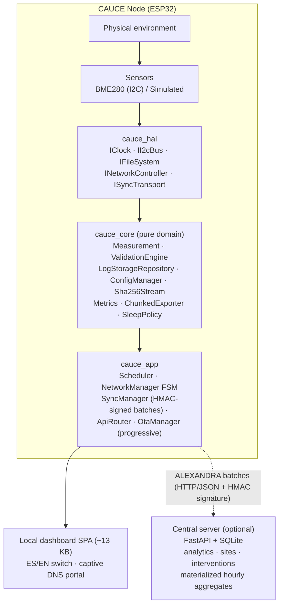
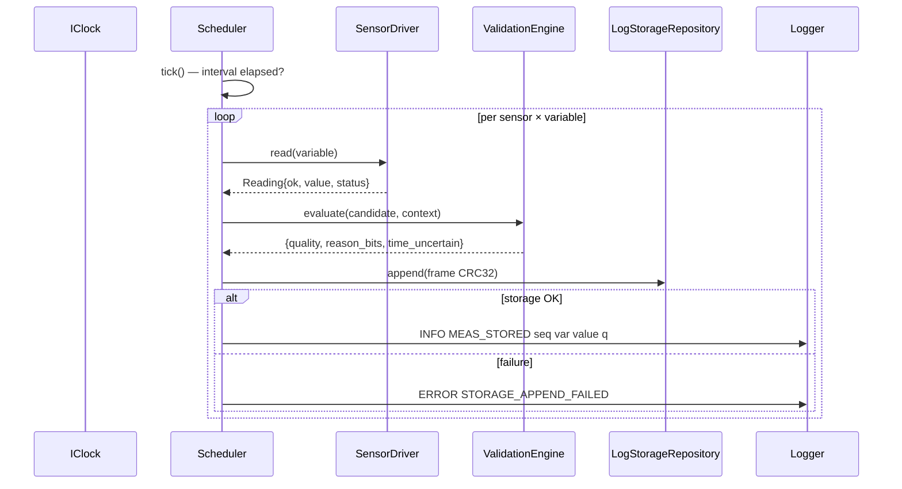
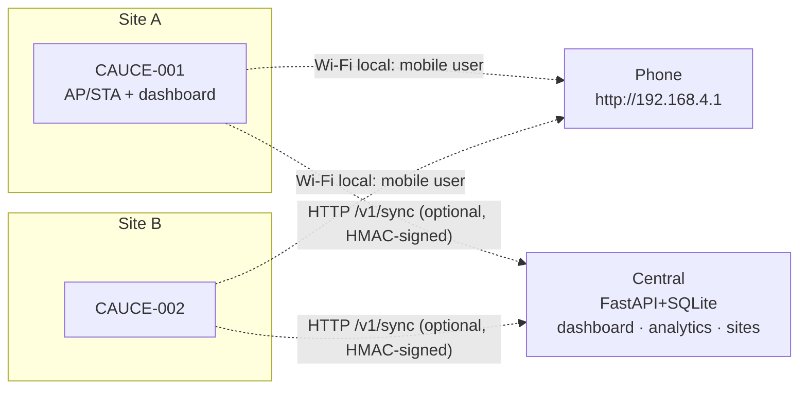
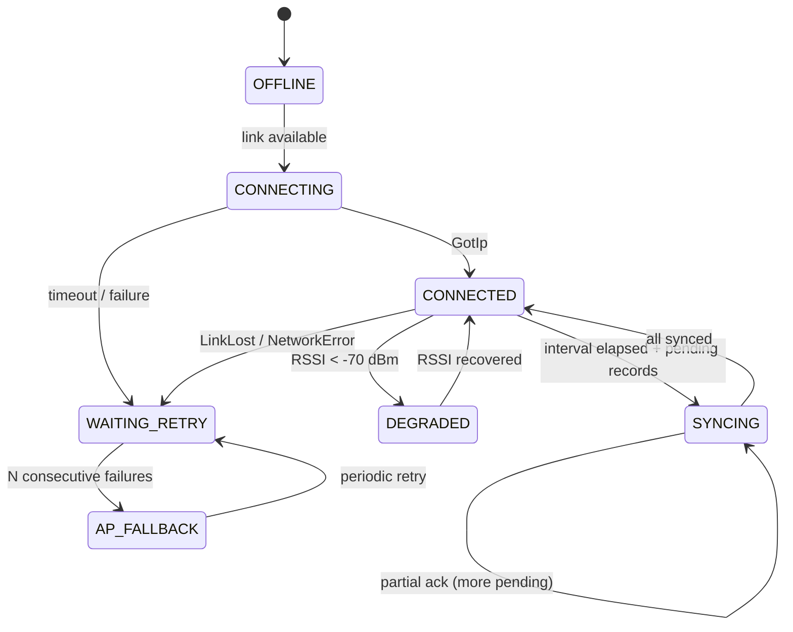
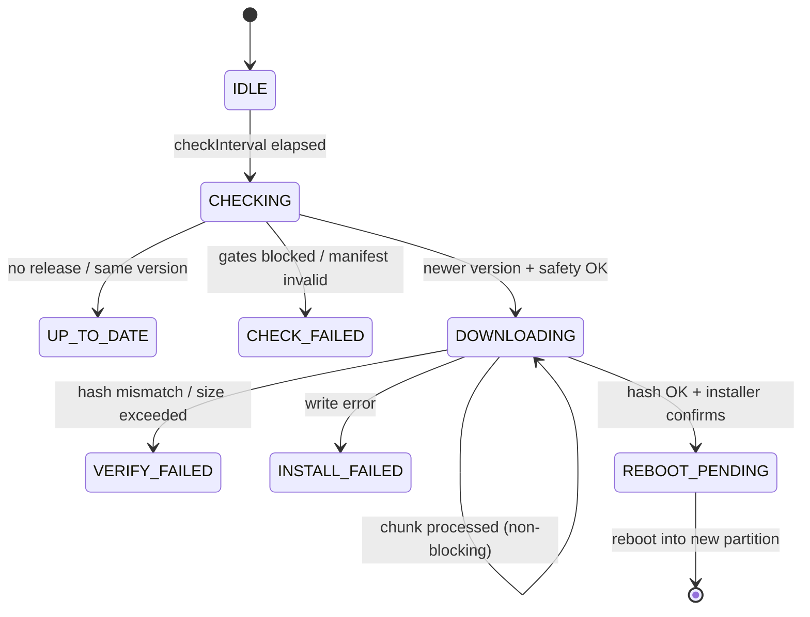

# CAUCE: A Distributed Microcontroller Infrastructure for Offline-First Edge Computing — Environmental Hyperlocal Monitoring as Case Study and ALEXANDRA as Exchange Protocol

---

## Abstract

This work presents the design, implementation and empirical evaluation of CAUCE, a distributed infrastructure of ESP32 microcontrollers that acquires, validates, stores and serves environmental data entirely at the network edge, without requiring permanent Internet connectivity or a central server for any essential function. The exchange of information between nodes and optional central infrastructure is formalized as **ALEXANDRA** (*Autonomous Local EXchange for Distributed Resource Architecture*), a protocol comprising three verifiable subsystems: (i) a versioned REST resource interface on each node, (ii) an idempotent batch synchronization protocol keyed by `(node_id, sequence)` with persistent watermarks and honest acknowledgements, and (iii) a CRC-32-framed append-only binary storage format with corruption-sealing semantics. On top of that core the implementation adds a runtime calibration overlay, bounded-cost analytics through materialized hourly and daily aggregates with automatic granularity selection, an at-least-once downlink command channel with end-to-end idempotency, a fragmented binary carrier for narrowband radio with gateway forwarding and acknowledgement, TLS termination, and per-principal authorization with capability scopes and site scoping. The system is validated through 461 firmware unit/integration tests running on host, 581 backend API tests including cryptographic verification vectors and cross-language wire-format vectors, an automated end-to-end pipeline executing a real C++ synchronization client against a live FastAPI server with direct SQLite assertions, cross-compilation to the ESP32 target, and a continuous integration workflow with five parallel jobs. Results demonstrate that the conjunction of scientific data validation, tamper-evident local storage, embedded web service, authenticated device identity and effectively-once remote ingestion -at-least-once delivery made idempotent by `(node_id, sequence)` deduplication, rather than a stronger transport guarantee- is achievable on a sub-USD 35 microcontroller platform without an RTOS, while maintaining a fully operational local dashboard during all background operations including over-the-air firmware updates. Peer-to-peer exchange and asymmetric signatures are specified as future evolution of the protocol and are deliberately not claimed as present; the system is a hybrid with full edge autonomy, not a mesh.

**Keywords:** embedded systems; microcontrollers; edge computing; IoT; distributed systems; offline-first; eventual consistency; wireless sensor networks; ESP32; environmental monitoring; HMAC authentication; append-only storage; idempotent synchronization.

---

# 1. Introduction

The dominant paradigm in the Internet of Things concentrates intelligence in cloud servers: devices capture signals, transmit them, and validation, historical storage and visualization occur remotely. This model introduces structural dependencies —continuous connectivity, remote availability, trust in a third-party operator— that become fragile when connectivity is intermittent or when the device's local function does not require it.

This work approaches the problem from the opposite direction: determining what functionality can be moved entirely to a low-cost microcontroller without sacrificing engineering rigour. The question is studied through CAUCE (*Red Comunitaria de Microestaciones Climáticas*), an implemented system whose primary use case is hyperlocal environmental monitoring: dense networks of microstations characterizing urban microclimate at block scale, where vegetation shading, surface thermal mass and urban geometry produce spatial variations that synoptic weather stations do not resolve.

The contribution is twofold:

**Technological**: CAUCE executes on a microcontroller with 520 KB SRAM and no operating system a complete pipeline of acquisition, statistical validation, integrity-verifiable persistence, embedded web API, local user interface and idempotent eventual synchronization — functions conventionally delegated to higher layers. Additionally, the system implements per-device HMAC-SHA-256 batch signing, progressive (non-blocking) over-the-air update state machine, materialized hourly analytics aggregates on the central server, and automated temporal reconstruction of records captured without trusted clock source.

**Methodological**: the system is covered by automated tests executable without hardware (461 firmware + 581 backend = 885 verifications), an end-to-end integration pipeline exercising the actual C++ synchronization client against a live server, and a continuous integration workflow — enabling reproducible study of its properties and clean separation between verified facts and design aspirations.

# 2. Problem Statement

## 2.1 Environmental problem

Cities experience differential intra-urban warming driven by shading, surface thermal capacity and geometry. Evaluating local adaptation interventions —tree canopy, green roofs, reflective surfaces— requires hyperlocal, simultaneous, sustained measurements before and after the intervention. Official meteorological stations, sparse and sited for synoptic purposes, do not provide this spatial granularity or local temporal density.

## 2.2 Technological problem

Hyperlocal instrumentation at dozens to hundreds of points poses requirements that centralized IoT architectures address poorly:

| Requirement | Typical failure of the centralized model |
|---|---|
| Operation without Internet | No visibility into measurements or history |
| Integrity under power cuts | Data loss from volatile buffers |
| Autonomy of measurement point | Node is a passive capture device without validation or local service |
| Horizontal scaling | Central server as bottleneck and single point of failure |
| Data sovereignty | Data resides in third-party infrastructure |

Formally: *design a self-contained low-cost computational unit guaranteeing validated acquisition, integral persistence and local service under arbitrary network partitions, with eventual synchronization toward optional infrastructure that introduces neither duplicates nor losses under any pattern of communication or power failure*. The difficulty lies in the conjunction: each property individually has known solutions; their intersection on a bare-metal microcontroller constitutes the engineering problem studied here.

# 3. Justification

- **Scientific**: edge-side quality validation (physical ranges, impossible jumps, frozen sensors, duplicates, time uncertainty) rejects measurement artefacts before analysis.
- **Technological**: demonstrates that an idempotent synchronization contract with persistent watermark —a pattern from server-class distributed systems— is achievable on a bare-metal microcontroller with automated E2E verification.
- **Environmental**: enables dense community networks where marginal cost per point is dominated by hardware (BOM USD 13–32) not by ingest infrastructure.
- **Educational/Community**: local operation with web interface, reproducible documentation and multi-vendor BOM enable competent non-original-developer construction and repair.
- **Architectural**: provides a complete case study —with tests— of offline-first, store-and-forward idempotent and graceful degradation patterns applied to constrained embedded systems.

# 4. Objectives

## 4.1 General objective

Analyze, on CAUCE's real implementation, the extent to which a distributed microcontroller architecture can sustain essential functions of acquisition, validation, storage, local service and eventual information exchange at the edge, characterizing its guarantees, costs and limits.

## 4.2 Specific objectives

1. Characterize the edge-side acquisition and scientific validation pipeline (variables, thresholds, quality states).
2. Analyze the local append-only persistence model with verifiable integrity and its behavior under partial corruption.
3. Evaluate node autonomy: embedded HTTP API, dependency-free web UI, operation without connectivity.
4. Specify and verify the ALEXANDRA eventual synchronization protocol (idempotency, watermark, honest acknowledgements, resumption).
5. Quantify the degree and limits of decentralization using standard taxonomy.
6. Analyze resilience against sensor, network, power and data-corruption failures.
7. Evaluate implemented security and its limitations.
8. Assess generalization of the resource abstraction to non-environmental domains.

# 5. Research questions

- **Q1** What proportion of the data lifecycle (acquisition, validation, persistence, serving, visualization) can execute entirely on an ESP32-class microcontroller without compromising rigour?
- **Q2** What integrity guarantees can a custom append-only binary format offer against power cuts, and at what cost?
- **Q3** Is the pair `(node_id, sequence)` sufficient as idempotency key to achieve exactly-once delivery at the receiver under arbitrary message loss, reordering and client-state loss?
- **Q4** What does "decentralization" operationally mean in this architecture, and which residual role is irreducible for the central server?
- **Q5** Which failure classes degrade the system to reduced functionality rather than total failure, and through what mechanisms?
- **Q6** Is the resource abstraction (measurement/state/configuration) sufficiently general for non-environmental domains?

# 6. Hypothesis

**H1 (Autonomy)**: An ESP32-based node can sustain indefinitely validated acquisition, integral storage and local web service under total connectivity absence, without unbounded memory growth or persistent corruption, provided retention policy is applied.

**H2 (Exact synchronization)**: The ALEXANDRA protocol —versioned batches with `(node_id, sequence)` key, watermark persisted after each ack, and receiver-side deduplication— guarantees that under any interleaving of losses, reorderings and post-state-loss re-sends, the server's record set converges to the local set without duplicates or omissions.

H1 is verified by design analysis and unit/integration tests plus host demonstration; physical confirmation awaits hardware bench. H2 has an automated E2E proof and a deduplication argument based on primary-key constraint at the receiver.

# 7. Theoretical framework

## 7.1 Embedded systems and microcontrollers

An embedded system couples computation to a physical process under time, energy and memory constraints. The ESP32 integrates dual-core Xtensa LX6 at 240 MHz, 520 KB SRAM, Wi-Fi 802.11 b/g/n radio and I2C/SPI/UART peripherals, running C++17 firmware on the Arduino framework without explicit RTOS usage in the hot path (the framework provides a cooperative loop over FreeRTOS). Absence of MMU and fragmentable heap impose discipline: fixed buffers, zero allocations on the measurement path, statically sized structures — visible in `Measurement` (≤68 B), storage frames and exporter buffers.

## 7.2 Edge computing

Edge computing displaces computation toward the perception layer to reduce latency, bandwidth and external dependence [14]. Fog computing positions it in intermediaries between edge and cloud [2]. CAUCE maximizes the edge spectrum: validation, persistence, web serving and quality decision occur entirely on the microcontroller; no fog layer exists — the central server is an optional synchronization endpoint.

## 7.3 Distributed systems and decentralization

A distributed system holds state across multiple nodes communicating via messages, subject to finite latency and partial failures [15]. CAP theorem formalizes the trade-off between consistency, availability and partition tolerance under weak synchronization [7]. The BASE family (*Basically Available, Soft state, Eventually consistent*) trades immediate strong consistency for availability with later convergence [3], [16]. CAUCE adopts: **local availability always** (each node is sole authority of its own append-only log, eliminating conflict possibility by having a single producer per record), and **eventual consistency toward the center** via monotonic idempotent transfer. No multi-master writes exist and no CRDT resolution is needed: the single-producer-per-record property eliminates the conflict class those mechanisms resolve [10], [17].

## 7.4 Wireless sensor networks and data acquisition

WSN literature studies nodes with integrated sensing, computation and communication [1]. Classical contributions include energy–latency–reliability trade-offs and in-network aggregation. CAUCE differs from classical WSN in three respects: IP Wi-Fi communication (high throughput, higher power) instead of low-power radios; aggregation **at the node** (not in-network); and direct user service from the sensor itself (embedded dashboard).

## 7.5 Cyber-physical systems and environmental instrumentation

A cyber-physical system closes the loop between physical phenomena and computation. Environmental instrumentation requires installation metadata traceability (site, height, exposure), real-time quality control, and separation between raw data, validated data and derived metrics. CAUCE materializes this separation in types (`Measurement` with `quality` and `reason_bits`) and documented analytical rules.

## 7.6 Offline-first and store-and-forward

Offline-first design treats disconnection as normal case, not exception. Associated patterns: authoritative local state, durable outbound queue, idempotent resend, watermark-based reconciliation. CAUCE implements all: the local log is the source of truth; synchronization is a derived projection with persisted watermark `last_acked_seq`.

# 8. State of the art

| Family | Representatives | Connectivity | Serverless operation | Edge validation | Local UI | Local integral storage |
|---|---|---|---|---|---|---|
| Community environmental platforms | SmartCitizen Kit [21]; Sensor.Community [22] | Wi-Fi to Internet, continuous push | No | Partial | Remote | Limited |
| LoRaWAN networks | The Things Network nodes [23] | LoRa → gateway → central | No | No | No | Minimal |
| Industrial edge gateways | Commercial products | Varied | Partial | Yes | Product-specific | Yes (embedded DB) |
| Educational ESP32 nodes | Arduino/MicroPython templates | Wi-Fi HTTP/MQTT push | No | No | Rare | Volatile buffer |
| **CAUCE/ALEXANDRA** | This work | Wi-Fi local (AP/STA); optional sync | **Yes** | **Yes** (statistical pipeline) | **Yes** (SPA ES/EN) | **Yes** (CRC32 frames, sealing) |

Related academic work: classical WSN establishes distributed sensing under energy constraints [1]; fog/edge literature argues displacement of computation toward data [2], [14]; modern data systems codify idempotency and watermark patterns that ALEXANDRA adapts to the embedded domain [9]. Honest comparison indicates CAUCE's contribution lies not in any isolated element but in the **verified combination of full node autonomy with demonstrable integrity and exact synchronization** on sub-USD 35 hardware with complete automated coverage.

# 9. Architecture

## 9.1 Layered view



Dependencies are strictly downward: the domain (`cauce_core`) includes no hardware or framework headers; all physical interaction goes through `cauce_hal` interfaces, enabling execution of the entire domain on host with test doubles.

## 9.2 Measurement pipeline



Each stage may fail without stopping the cycle: failed read increments counters and emits a `MISSING` placeholder after two consecutive misses; storage failure logs and retries next tick.

## 9.3 Deployment topology



# 10. The CAUCE node as computational unit

| Function | Real component | Evidence |
|---|---|---|
| Acquisition | `Bme280Driver` (forced mode, Bosch integer compensation + float mirror); `SimulatedSensorDriver` with fault injection | Datasheet-vector tests; fault tests |
| Processing | `ValidationEngine`: non-finite, physical range, rate-of-change, frozen (≥6 identical within ε=0.01), duplicate sequence; `Metrics` (mean, median, sample stddev, interpolated percentiles, windowed aggregation, trapezoidal exposure hours) | 9 + 8 tests |
| Storage | `LogStorageRepository`: 68-byte frames `[0xCA][0x01][len=60][payload][CRC32]`, size rotation, byte-budgeted retention, corrupt-tail sealing, **CK01 checkpoint for O(segments) reopen** | 9 tests incl. crash recovery + fast-path |
| Communication | `ApiRouter` (8 REST resources + streaming pagination ≥384 B/chunk), `Esp32ApiServer` on WebServer chunked transfer, `SyncManager` (batches ≤32 records, buffer member-not-stack, backoff 10s→1800s, auth-backoff 900s, halt-on-reject, **HMAC-SHA-256 signed**) | 12 router tests; 10 sync tests incl. signing |
| Autonomy | Dashboard SPA embedded (~13 KB, ES/EN switch), captive DNS wildcard portal, full operation without Internet | HTML integrity tests; DNS compile-verified |

The node is simultaneously producer, custodian and provider of its information: no essential function requires an external peer.

# 11. Edge computing in CAUCE

Of the data lifecycle stages, six execute entirely on the microcontroller:

| Stage | Location | Detail |
|---|---|---|
| Acquisition | Node | I2C conversion + Bosch scientific compensation |
| Validation | Node | Statistical pipeline with auditable states and reason bits |
| Filtering | Node | Exclusion of INVALID/MISSING/ESTIMATED from all metrics |
| Persistence | Node | Append-only CRC32 frames, budgeted retention |
| Visualization | Node | Locally served SPA, native canvas chart |
| API service | Node | Versioned REST with admin authentication |
| Synchronization | Node→Central | Only cooperative function (may be absent) |

**Advantages**: zero local query latency, data residency privacy, graceful degradation, zero network marginal cost. **Limitations**: bounded compute (no heavy models), finite history (configurable budget, default 512 KiB ≈ 7 100 records), no cross-node analysis without the center.

# 12. Distributed vs decentralized architecture

Following standard taxonomy:

| Model | Operational definition | Applies to CAUCE? |
|---|---|---|
| Centralized | One point owns state and service; others are dependent peripherals | No: each node functions without the center |
| Distributed | State spread across cooperating nodes toward common goal | Partially: multiple nodes own state, but no direct peer cooperation exists |
| Purely decentralized | Equivalent peers coordinate without authority | Not implemented: no node↔node exchange exists. Downlink does not change this, because every command still travels through the central |
| Hybrid (federated) | Full border autonomy + optional central services | **Yes: most accurate description** |

Terminological conclusion: CAUCE is a **hybrid system with full edge autonomy**. Decentralization exists in the *data control* plane (each node is authority and custodian); analytical coordination remains optionally centralizable. Calling the current system "purely decentralized" would be imprecise.

# 13. Protocol ALEXANDRA

**ALEXANDRA — Autonomous Local EXchange for Distributed Resource Architecture** — is the distributed exchange protocol associated with the CAUCE architecture. In its current formulation it defines how a resource (measurement, status, configuration) produced on a node is represented, locally custodied and transferred toward optional infrastructure guaranteeing idempotency and traceability. Three planes are distinguished: **[I]** implemented, **[A]** architectural interpretation, **[F]** future evolution.

## 13.1 Principles [I]

| # | Principle | Materialization |
|---|---|---|
| A-1 | Immutable record identity | Key `(node_id, sequence)`; monotonic `sequence` persisted across reboots |
| A-2 | Verifiable at-rest integrity | Binary frame with per-record CRC-32; segment sealed upon tail corruption |
| A-3 | Honest acknowledgement | `acknowledged_sequence` = highest sequence actually present in receiver database; never fabricated |
| A-4 | Idempotency | Primary-key deduplication at server; re-sends have no data effect |
| A-5 | Resumption | Watermark persisted after each individual ack; state-file loss triggers full replay converging via A-4 |
| A-6 | Versioning | `protocol_version=1` in envelope and frame; unsupported versions explicitly rejected |
| A-7 | Safe degradation | Exponential backoff on network errors; fixed long backoff on auth failure; definitive halt on semantic rejection |
| A-8 | Device authenticity | Each batch carries HMAC-SHA-256 over the raw body using a per-device provisioning key; server verifies constant-time |
| A-9 | Stable iteration over a moving target | Opaque cursors (`(timestamp_utc_ms, sequence)` for measurements, `node_id` for the fleet) so a long read stays consistent while the fleet keeps writing; `limit`/`offset` retained for compatibility |
| A-10 | Bounded cost over long horizons | Materialized hourly and daily aggregates, with `granularity=auto` selecting the cheapest honest answer and declaring in the response which one it used |
| A-11 | At-least-once downlink | A command is identified by `(node_id, idempotency_key)`, re-offered until acknowledged, executed at most once by the node through flash-persisted applied ids; delivery state is reported honestly as pending, delivered, acked or expired rather than assumed |
| A-12 | Derived, never rewritten | Calibration is an overlay applied on read; `measurements.value` stays raw, so a recalibration replays over history without touching a node |

## 13.2 Messages [I]

Node→central batch envelope (`POST /v1/sync`):

```json
{"protocol_version":1,"node_id":"CAUCE-001","batch_size":    5,
 "measurements":[{"node_id":"CAUCE-001","sensor_id":"BME280-1",
   "sequence":1842,"timestamp":"2026-08-22T00:01:00Z",
   "timestamp_utc_ms":1787356860000,"variable":"air_temperature",
   "value":21.50,"unit":"C","quality":"VALID","reason_bits":0,
   "time_uncertain":false}]}
```

Headers when provisioned:
```
X-CAUCE-Node: CAUCE-001
X-CAUCE-Signature: <64-char hex HMAC-SHA256(device_key, raw_body)>
```

Central→node ack: `200 {"acknowledged_sequence":1842}` · `401` invalid credentials/signature · `422` semantic rejection (client halts) · network errors → exponential backoff.

The `200` also carries `"commands": [...]`, so downlink rides the round trip the
node already makes and costs no extra radio wakeup. The node answers with
`"command_receipts"` in its next batch, and a receipt naming another node's
command is counted and ignored: a node is an authenticated peer, not an
authority over someone else's command.

Narrowband carrier (`transport: "lora"`) uses a binary frame rather than the JSON
envelope. A measurement payload is 60 bytes and a LoRa uplink at SF9 carries 115,
so a batch is fragmented across frames:

```
frame   0..1   magic 0xCA | version 1
        2..3   batch_id        4      fragment_index
        5      fragment_count  6..7   record_count (whole batch)
        8..9   payload_bytes   10..   record payloads, 60 B each
        last 2  CRC16-CCITT
```

The gateway reassembles, forwards one `POST /v1/sync` per batch, and
acknowledges the highest sequence the server **durably stored** rather than the
highest it received, so the node advances its watermark only for data that
actually landed. Fragments that are foreign, duplicated or corrupt are refused
rather than merged, because merging a bad fragment corrupts the batch silently.
SF10 and below are refused rather than truncated: half a measurement is worse
than none.

The encoder (C++, firmware) and the decoder (Python, gateway) are independent
implementations of this format, and the exact bytes are pinned as
cross-language known-answer vectors in both directions, including the
acknowledgement frame, so neither side can drift while still passing its own
tests.

Node REST resources: `/api/v1/node`, `/status`, `/measurements/latest`, `/measurements?from&to`, `/health`, `/config` (GET public; POST with Bearer→SHA-256), `/export?format=csv|json`. Exchange formats: CSV RFC 4180 and JSON array, both streamed paginated.

## 13.3 Network state machine [I]



Backoffs: network 5s→300s exponential; sync 10s→1800s exponential; auth 900s fixed. Watermark written to flash after each individual ack.

## 13.4 Non-implemented planes

- **[A] Generic resources**: the variable–unit pair and quality states are climate-independent; ALEXANDRA can be read as a general telemetry-resource exchange schema signed by producer+sequence (§14).
- **[F] Peer-to-peer exchange**: mDNS discovery, ESP-NOW transport, node↔node replication and CRDT merge do not exist in the codebase; proposed evolution.
- **[I] Cryptographic trust**: asymmetric signatures (Ed25519) for batches and OTA manifests are proposed; current integrity-at-rest uses CRC (detection only) and authentication uses symmetric HMAC. Deferred for a stated reason rather than a preference: the firmware provides SHA-256 and HMAC with no bignum arithmetic, so curve operations would be written from scratch on a part with no room to review them, while per-device symmetric keys plus TLS already cover the pilot threat model.
- **[I] Downlink channel**: node-to-central delivery and idempotency ship (`POST /v1/nodes/{id}/commands`, carried in the `/v1/sync` response, applied ids persisted in flash, receipts reported back). Actuation does not: the shipped kinds validate arguments and report. This required first giving `ILoRaRadio` and `ISyncTransport` a receive path, since both were send-only.

# 14. Resource model

The node's REST interface already exposes addressable resources: `node` (identity/versions), `status` (FSM states + latest measurement), `measurements` (queryable/exportable collection), `health` (internal telemetry), `config` (protected mutable state). This form suggests generalization where each node capability —sensor, battery, storage, even future actuators— publishes as a resource with identity, version and ALEXANDRA exchange.

Strictly environmental components reduce to the variable catalogue and physical thresholds (`Thresholds`); everything else (validation pipeline, frame format, API, sync, OTA) is generic. Domains such as agriculture (soil moisture as new `Variable`), energy (current/voltage per circuit) or urban monitoring (noise, occupancy) require adding types to the catalogue and specific calibration, without modifying protocol core or storage.

# 15. Communication

Technologies actually present: **Wi-Fi 802.11 b/g/n** in AP mode (portal/dashboard) and STA mode (HTTP client); **HTTP/1.1** with chunked transfer for API/dashboard and POST JSON for sync; **DNS** wildcard for captive portal; **I2C** at 100 kHz for sensors. Not present: MQTT, CoAP, ESP-NOW, Bluetooth, mesh.

Justified comparison: HTTP chosen for universal interoperability (browsers, curl, servers), debuggability and zero dependencies; cost is higher per-message overhead than MQTT/CoAP, acceptable given sync cadence (minutes). For non-IP or ultra-low-power networks, LoRaWAN or ESP-NOW would be evolution candidates [F], adapting ALEXANDRA's transport layer (interface `ISyncTransport` already isolates that point).

# 16. Offline operation

| Scenario | Real behaviour | Verification |
|---|---|---|
| No Internet from boot | Acquisition, validation, storage, dashboard and API operate normally; records flagged `time_uncertain` if no time source | Tests with invalidated clock |
| Loss during operation | FSM → `WAITING_RETRY` with backoff; sync suspended; measuring continues | Network/sync suites |
| Node reboot | Open scans segments rebuilding state; sequence continues max+1 | `sequence_continues_across_reboot_without_duplicates` |
| Power cut mid-write | CRC detects partial frame; previous frames remain valid | Design + garbage-tail test |
| Server down | Exponential backoff up to 1800 s; local data integral; no loss | Sync tests with failing transport |

# 17. Storage and data

## 17.1 Model

Each measurement occupies a **68-byte frame**: 4-byte header (`magic 0xCA`, `version 0x01`, length u16), 60-byte payload (sequence u32, timestamp u64, value f32, variable, quality, reason bits, time flag, `node_id[16]`, `sensor_id[24]`) and CRC-32 IEEE (reflected polynomial 0xEDB88320) over the preceding 64 bytes. Explicit little-endian format, compiler-independent.

## 17.2 Integrity and recovery

Sequential read validates per-frame CRC; on first failure, partial-tail assumed and segment **sealed**: valid records remain queryable, new writes rotate to clean segment —no flash truncate needed—. Prior history preserved with detection probability 1−2⁻³² per altered frame.

## 17.3 Budget and scaling

With defaults (512 KiB total, 64 KiB segments ≈ 910 frames) and 60 s cadence, node retains ≈15 h at full resolution before rotation; retention removes oldest keeping ≥1. Larger windows belong to the central: SQLite with indexes `(node_id, timestamp)` and `(variable, timestamp)` plus materialized hourly aggregates for O(buckets) long-range queries.

## 17.4 Time

Timestamps in ms UTC; without trusted source stored as 0 with `time_uncertain` flag, preserving local order by sequence. Post-NTP temporal reconstruction available on the central via `/v1/nodes/{id}/time-reconstruct` using first-anchor + median-interval algorithm, flagging reconstructed rows.

# 18. Resilience

| Failure | Mechanism | Resulting state | Verification |
|---|---|---|---|
| Sensor disconnected | Read fails → counter → MISSING placeholder after 2 cycles; other sensors continue | Per-sensor degradation | scheduler test |
| Sensor frozen | Identical streak ≥6 → SUSPECT | Flagged data | validation test |
| Connectivity loss | Network FSM → backoff; measurement intact | Full autonomy | network/sync suites |
| Reboot | Segment scan rebuilds state; sequence continues max+1; CK01 checkpoint accelerates reopen | No duplicates | storage/scheduler tests |
| Storage failure | Counter + log; retry next cycle | Node operational | scheduler test |
| Data corruption | CRC + seal + rotate | Valid history preserved | storage test |
| Server down | Exponential backoff; watermark persists | Exact resend on return | E2E phase 3 |
| OTA corrupted image | Streaming hash ≠ manifest → abort; alternate partition intact | VERIFY_FAILED | OTA suite |
| Signed manifest substituted | HMAC ≠ expected → CHECK_FAILED before download | No download executed | manifest_signature test |

# 19. Security

**Implemented**: admin tokens stored only as SHA-256 (NIST-vector verified), compared constant-time on both node and server; strict validation of all external input (ranges, bounded lengths); static buffers with zero hot-path allocations; public-read/authenticated-write separation; fail-closed (POST /config without token → 503); per-IP rate limiting with bounded SQLite-backed memory on every endpoint; secret masking in GET `/config`; minimum privacy (environmental telemetry + node identifiers only); **per-device HMAC identity** with provisioning endpoint and raw-body signature verification; **OTA manifest authentication gate** before download acceptance.

**Known limitations**: transport encryption terminates at a reverse proxy shipped with the project (`deployment/Caddyfile`), which obtains a real ACME certificate by default and can fall back to an internal CA with `CAUCE_TLS_MODE=internal`, with the central bound to loopback; plain HTTP on a bare LAN deployment remains possible and a public exposure needs a public DNS name; node identity is self-declared unless provisioned (unsigned nodes accepted only when no provisioning exists); no asymmetric signatures (Ed25519) for OTA images; captive DNS accepts any domain by design; Wi-Fi password stored plaintext in config (required for use, mitigated by LAN-only exposure). Coherent for community pilot on trusted network; insufficient for hostile public deployment.

**The gateway used to weaken A-8; it no longer does, and the correction is instructive.** The original path authenticated each batch with a per-device HMAC over the *raw request body*, so a gateway forwarding on a node's behalf had to hold that node's `device_key`. The consequence was that a gateway became a trusted party equivalent to every node it served: whoever compromised it could forge any of them. That debt was visible in §13 even though the gateway was not part of the original formulation — it arrived with milestone M2, and the forwarding path was chosen because it required no change to the server's verification surface.

The first attempt at the fix was wrong, and the way it was wrong is the substance of the correction. The gateway was rebuilt to hold no keys and to verify nothing, but an intermediate version had it *verify* each frame's signature locally before relaying. That achieves nothing: HMAC is symmetric, so a party able to verify with the shared secret is equally able to produce a valid signature with it. A verifying gateway is a forging gateway, and the dependency survives the refactor intact. The property is only actually removed when the gateway never receives the key.

The design that holds is therefore asymmetric in an unusual place. The node signs every compact frame it transmits, appending a 32-byte HMAC-SHA-256 over header, payload and CRC. The gateway reassembles fragments using header fields only, copies the signed bytes verbatim and POSTs them; it has no key and no constructor argument for one, so the weak configuration cannot be written by accident, and it never signs anything, not even the JSON it forwards. The central verifies each frame against the `device_key` it already issued at provisioning and reconstructs measurements only from frames that verify. A malicious relay can drop frames, reorder them, misreport framing metadata or flood the endpoint; it cannot manufacture a measurement, because producing one requires a valid per-node MAC. The relay is trusted only to deliver bytes.

Two properties of the construction are worth stating because they are easy to get wrong. The signature covers the CRC trailer as well as the header and payload, so a frame cannot be altered, re-CRCed and replayed — the CRC is an integrity check against transmission noise, not a security control, and authentication is what notices a deliberate edit. And the signature is appended outside the CRC and outside the frame length accounting, so the node reserves 32 bytes of the air-interface budget when it has a key and keeps the full budget when it does not; re-fragmenting an already-deployed unsigned node to make room for a signature it never sends would have been a gratuitous change to its air interface.

Residual exposure is stated rather than dissolved. Within one node's trust domain the scheme remains symmetric, so a node's key still compromises that node alone and no other; what changed is the *number of parties* holding it, which is now one per node instead of one per node plus every gateway that serves it. The construction does not provide non-repudiation or forward secrecy, and a relay that suppresses traffic entirely produces silence rather than a detectable forgery, so availability remains outside what this mechanism defends. Ed25519 (§13[I]) would replace it where non-repudiation is required; per-principal `read`/`write`/`admin` scopes with optional site scoping continue to bound what any single credential can reach.

# 20. Environmental use case

Implemented variables: air temperature (−40..85 °C, ±5/min), relative humidity (0–100 %RH, ±20/min), pressure (300–1100 hPa, ±2/min), illuminance (0–200 000 lx), battery voltage (2.5–4.5 V). The architecture enables:

- **Microclimate and spatial variation**: co-installed nodes comparable after relative co-location calibration (documented procedure).
- **Thermal stress**: trapezoidal exposure above threshold (e.g., hours >32 °C) computed at node and replicable centrally.
- **Before/after evaluation**: interventions registered with time windows; endpoint separates pre/post statistics and **declares sample insufficiency** (<30 valid per period) rather than permitting weak conclusions.
- **Quality as first-class citizen**: every datum carries quality and motive; metrics exclude INVALID/MISSING/ESTIMATED.

Specific limitations: no metrological certificate (declared accuracy = manufacturer datasheet, not verified by project); drift and self-heating uncharacterized; physical exposure determinant but documented not instrumented.

# 21. Generalization

| Category | Components |
|---|---|
| Domain-neutral generic | Frames+CRC, append-only repository, parametric validator, exporters, REST API, idempotent sync, OTA, config, logger, statistics |
| Parameterizable | Variable/unit catalogue, physical thresholds, site metadata |
| Environment-specific | BME280 compensation, climate default thresholds |
| Hardware-specific | ESP32 HAL (I2C/Wi-Fi/LittleFS/clock) |

Candidate domains with minimal change: agriculture (soil moisture, conductivity), energy (current/voltage per circuit), infrastructure (vibration, occupancy), education (real distributed-systems teaching platform). Architectural condition: express the new domain as monotonic resources with unique producer —the property eliminating replication conflicts—.

# 22. Technical analysis

| Dimension | Value/behaviour | Source |
|---|---|---|
| Flash firmware | ≈363 KB of 1.3 MB (27.7%) | esp32dev build |
| RAM | Fixed buffers; no hot-path heap | design |
| Record | 68 B → ≈7 700 records in 512 KiB | format arithmetic |
| Cadence | Default 60 s; configurable 10–3600 s | NodeConfig |
| Local query latency | HTTP LAN served from local flash/RAM | architecture |
| Synchronization | Batches ≤32 declared; progressive drain; backoff ≤1800 s; HMAC signed | SyncManager |
| Energy | No deep sleep; Wi-Fi always-on → high consumption profile; advisory-only policy | STATUS.md |
| Central scalability | O(1) amortized ingest per record (PK dedup); summary-fast reads O(hourly buckets) and `granularity=auto` selects them past 7 days; only explicit `granularity=raw` pays O(n) — adequate for 10¹–10² node pilots | backend design |
| Maintainability | 1042 automated tests (461 firmware, 581 backend); CI 5 jobs; reproducible docs | repository |
| Cost | BOM 13–32 USD/node multi-vendor | HARDWARE.md |

Formulas implemented —rate-of-change: r = Δv / Δt_min; sample deviation: s = √(Σ(xᵢ−x̄)²/(n−1)); interpolated percentile: P(p) linear between order statistics; trapezoidal exposure: E = Σ(tᵢ₊₁−tᵢ) for consecutive above-threshold pairs, in hours; bounded exponential backoff: tₙ = min(t₀·2^(n−1), t_max).

# 23. Discussion

Against WSN literature, CAUCE inverts two classical assumptions: prioritizes IP Wi-Fi over low-power radios (accepting higher consumption in exchange for direct user service and domestic infrastructure reuse), and aggregates at-node instead of in-network. Against the cloud-centric IoT paradigm, it demonstrates that the edge can assume validation, integral custody and presentation without loss of rigour —positioning itself at the edge-dominant extreme of the fog/edge spectrum [14].

ALEXANDRA functionally corresponds to consolidated patterns —ingestion cursor/watermark, idempotency key, store-and-forward— applied under embedded constraints [9], [15]. The contribution is not theoretical but verified integration: the combined property "no duplicates under any interleaving" is demonstrated by automated E2E testing including the adversarial scenario of complete client-state loss.

# 24. Limitations

1. **Hardware not physically validated**: everything runs on host or cross-compilation; real BME280, LittleFS, Wi-Fi radio and power cuts await bench testing.
2. **Security**: TLS available in front of the central and HMAC-signed batches implemented, but no asymmetric signatures, self-declared node identity for unsigned nodes and open captive DNS remain. A LoRa gateway must hold the device key of every node it forwards for, so it is as trusted as those nodes: key distribution to gateways is an open problem, not a configuration detail (§19).
3. **Energy**: deep sleep policy implemented and host-tested but disabled by default, so continuous operation is still incompatible with modest solar without specific sizing and bench measurement.
4. **Open-scan O(file)**: acceptable to ≈10⁵ records; CK01 mitigates but scan fallback remains O(bytes).
5. **Central analytics**: `granularity=auto` avoids O(n) past 7 days, but coverage accounting and explicit raw queries remain row-bound.
6. **Single transport** HTTP/JSON; no compact binary or compression for narrow links.
7. **Incomplete decentralization**: no peer discovery or replica; central concentrates aggregate view (not integrity).
8. **Scientific precision**: relative calibration is implemented and applied across analytics, exports and dashboard, and a calibration record can now carry an absolute uncertainty and say where it came from; it was still never physically executed and there is no metrological traceability.
9. **Field maintenance**: maintenance events can be logged through the API, but the physical replacement and its recalibration are still manual acts.
10. **Multi-profile complexity**: HAL+domain+app+backend demands rare full-stack profile; mitigated by the automated suite.

# 25. Future work

Ordered by dependency rather than by size, because the first three change what
the protocol can claim and the rest are engineering on a settled foundation.

1. **Node-signed frames [F]**: the node signs the compact LoRa frame and the
   server verifies against the frame instead of the reconstructed body. First
   because it removes the one place where the implementation currently weakens
   A-8 (see §19), and because it is the prerequisite that makes the next two
   cheap instead of controversial.
2. **Asymmetric signatures [F]**: Ed25519 over the same frame, with the node's
   public key in its provisioning record. Once the frame is already signed this
   substitutes one primitive for another, rather than introducing signing into
   a protocol that has none. It answers the problem symmetric keys structurally
   cannot: a party that must verify without being trusted to impersonate.
3. **Peer-to-peer exchange [F]**: ESP-NOW/mDNS discovery and sequence-based
   merge between equivalent nodes. Deferred longest precisely because the
   receive path, cursors and idempotent ingestion it would rest on already
   exist, which makes it an ordering decision rather than a foundation problem.
   CBOR/CoAP remains optional transport.
4. **Physical bench**: BME280, LittleFS and Wi-Fi validation; instrumented
   power-cut trials; enabling deep sleep once its saving is measured.
5. **Radio**: an SX1276 driver and a link budget. The frame format,
   fragmentation, acknowledgement and the whole forwarding loop are verified
   end to end against the server; only the air interface is unproven.
6. **OTA closure**: the ESP32 HTTP reader, manifest signing and post-boot
   boot-counter confirmation ship, with the attempt counter persisted in flash
   and the download no longer blocking the scheduler. Only the physical flash
   and rollback trial remain.
7. **Granular authorization breadth**: per-principal scopes and site scoping
   ship, and are applied to calibration, maintenance and commands; the
   remaining read endpoints still run behind the shared gate.
8. **Time**: NTP discipline and central temporal reconstruction ship with an
   honest margin-of-error statement; tightening that margin remains.
9. **Analytics**: hourly and daily aggregates with `granularity=auto` ship;
   sub-hourly buckets remain, and are the only granularity that would cost
   resolution rather than add speed.
10. **Actuators**: the idempotent command channel with confirmation and the
    compact LoRa carrier ship; what remains is the actuation handlers, which
    should stay validation-only until there is hardware whose actuation is safe
    to repeat.
# 26. Conclusions

- **What CAUCE is**: a distributed hybrid infrastructure of ESP32-based microstations whose primary use case is hyperlocal environmental monitoring, built as a generalizable edge acquisition–custody–exchange platform.
- **What architecture it implements**: strict layers with hardware-independent pure domain; append-only persistence with per-record verifiable integrity; embedded API and UI; optional eventual synchronization; alternate-partition secure update.
- **How much processing happens at the edge**: the entire lifecycle except multi-node transversal analytics —acquisition, statistical validation with auditable states, filtering, integral storage, local visualization, exportation and authentication—.
- **What degree of decentralization it has**: full data-and-function autonomy per node (strict offline-first), with optional non-irreducible central coordination; formally hybrid, not peer-to-peer.
- **What role ALEXANDRA plays**: formal exchange contract -versioned REST resources per node, idempotent `(node_id, sequence)` batches with honest ack and persistent watermark, HMAC-signed with per-device keys, versioned at-rest format, opaque cursors for stable iteration, and at-least-once downlink with flash-persisted exactly-once application-; twelve principles are implemented and tested, while peer-to-peer exchange and asymmetric signatures remain specified future evolution. One implementation debt is recorded explicitly: the LoRa gateway must hold each node's device key to forward on its behalf, which weakens the device-authenticity principle until nodes sign frames directly (§19, §25).
- **What the project demonstrates** (H1, H2): the §2.2 conjunction is achievable on a sub-USD 35 microcontroller with automated coverage —885 verifications (461 firmware, 581 backend) including E2E against a live server— covering even the adversarial scenario of complete client-state loss without duplicates or omissions.
- **Limitations**: pending physical validation, absence of asymmetric signing, today's continuous-power requirement, scanning and row-bound queries scaled to pilot size, and a calibration layer whose uncertainty is not quantified.
- **Generalization potential**: high —the core is domain-neutral— conditioned on new domains preserving the single-producer-per-record property that grounds ALEXANDRA's simplicity.

---

# References

[1] I. Akyildiz, W. Su, Y. Sankarasubramaniam, E. Cayirci, "Wireless sensor networks: a survey", *Computer Networks*, vol. 38, no. 4, pp. 395–422, 2002.

[2] F. Bonomi, R. Milito, J. Zhu, S. Addepalli, "Fog Computing and Its Role in the Internet of Things", *Proc. MCC Workshop on Mobile Cloud Computing*, ACM, 2012.

[3] E. Brewer, "Towards Robust Distributed Systems", keynote, *ACM PODC*, 2000.

[4] Espressif Systems, *ESP32 Series Datasheet* and *ESP32 Technical Reference Manual*, official documentation, 2023. Available: https://www.espressif.com/en/support/documents/technical-documents

[5] Bosch Sensortec, *BME280: Combined humidity and pressure sensor*, datasheet BST-BME280-DS002, 2022. Available: https://www.bosch-sensortec.com

[6] R. Fielding, J. Reschke (eds.), "Hypertext Transfer Protocol (HTTP/1.1): Semantics and Content", RFC 7231, IETF, 2014.

[7] S. Gilbert, N. Lynch, "Brewer's conjecture and the feasibility of consistent, available, partition-tolerant web services", *ACM SIGACT News*, vol. 33, no. 2, pp. 51–59, 2002.

[8] ISO/IEC 30141:2018, *Information technology — Internet of Things (IoT) — Reference architecture*, ISO/IEC, 2018.

[9] M. Kleppmann, *Designing Data-Intensive Applications*, O'Reilly Media, 2017.

[10] L. Lamport, "Time, Clocks, and the Ordering of Events in a Distributed System", *Communications of the ACM*, vol. 21, no. 7, pp. 558–565, 1978.

[11] OASIS, *MQTT Version 5.0*, OASIS Standard, 2019. Available: https://docs.oasis-open.org/mqtt/mqtt/v5.0/

[12] Z. Shelby, K. Hartke, C. Bormann, "The Constrained Application Protocol (CoAP)", RFC 7252, IETF, 2014.

[13] J. H. Saltzer, M. D. Schroeder, "The Protection of Information in Computer Systems", *Proceedings of the IEEE*, vol. 63, no. 9, pp. 1278–1308, 1975.

[14] W. Shi, J. Cao, Q. Zhang, Y. Li, L. Xu, "Edge Computing: Vision and Challenges", *IEEE Internet of Things Journal*, vol. 3, no. 5, pp. 637–646, 2016.

[15] A. S. Tanenbaum, M. van Steen, *Distributed Systems: Principles and Paradigms*, 3rd ed., distributed-systems.net, 2017.

[16] W. Vogels, "Eventually Consistent", *Communications of the ACM*, vol. 52, no. 1, pp. 40–44, 2009.

[17] A. Demers et al., "Epidemic Algorithms for Replicated Database Maintenance", *Proc. ACM PODC*, pp. 1–12, 1987.

[18] F. Adelantado et al., "Understanding the Limits of LoRaWAN", *IEEE Communications Magazine*, vol. 55, no. 9, 2017.

[19] Y. Shafranovich, "Common Format and MIME Type for Comma-Separated Values (CSV) Files", RFC 4180, IETF, 2005.

[20] Espressif Systems, *ESP-IDF Programming Guide — Over The Air (OTA) Updates*, official documentation, consulted 2026. https://docs.espressif.com/projects/esp-idf/en/latest/esp32/api-reference/system/ota.html

[21] Institute for Advanced Architecture of Catalonia, *SmartCitizen Kit — Documentation*, consulted 2026. https://docs.smartcitizen.me

[22] Sensor.Community, *Documentation of the participative sensor network*, consulted 2026. https://sensor.community

[23] The Things Network, *LoRaWAN architecture documentation*, consulted 2026. https://www.thethingsnetwork.org/docs

[24] CAUCE Project, *Reference implementation repository* (firmware, backend, simulator and automated verification suite), primary source of this work, analysed version 2026.

[25] IETF, "HMAC: Keyed-Hashing for Message Authentication", RFC 2104, 1997.

[26] NIST, *Secure Hash Standard (SHS)*, FIPS PUB 180-4, 2015.

---

# Annexes

## Annex A. Binary measurement frame layout (68 bytes)

| Offset | Size | Field | Encoding |
|---|---|---|---|
| 0 | 1 | magic | 0xCA |
| 1 | 1 | version | 0x01 |
| 2 | 2 | payload_len | u16 LE (=60) |
| 4 | 4 | sequence | u32 LE |
| 8 | 8 | timestamp_utc_ms | u64 LE (0 = uncertain) |
| 16 | 4 | value | IEEE-754 f32 LE |
| 20 | 1 | variable | enum u8 |
| 21 | 1 | quality | enum u8 |
| 22 | 1 | reason_bits | bitmask u8 |
| 23 | 1 | time_uncertain | 0/1 |
| 24 | 16 | node_id | char[] NUL-terminated |
| 40 | 24 | sensor_id | char[] NUL-terminated |
| 64 | 4 | crc32 | CRC-32 (poly 0xEDB88320 reflected) over bytes [0..63] |

## Annex B. ALEXANDRA batch example (node → central)

```json
{"protocol_version":1,"node_id":"CAUCE-001","batch_size":    5,
 "measurements":[{"node_id":"CAUCE-001","sensor_id":"BME280-1",
   "sequence":1842,"timestamp":"2026-08-22T00:01:00Z",
   "timestamp_utc_ms":1787356860000,
   "variable":"air_temperature","value":21.50,"unit":"C",
   "quality":"VALID","reason_bits":0,"time_uncertain":false}]}
```

Headers (provisioned):
```
X-CAUCE-Node: CAUCE-001
X-CAUCE-Signature: <hex hmac-sha256(device_key, raw_body)>
```

Ack: `200 {"acknowledged_sequence":1842}`. The `batch_size` field is space-padded (valid JSON); its fixed width allows in-place patching without a second buffer.

## Annex C. Default validation thresholds

| Variable | Range | Max change/min |
|---|---|---|
| air_temperature | −40..85 °C | ±5 |
| relative_humidity | 0..100 %RH | ±20 |
| pressure | 300..1100 hPa | ±2 |
| illuminance | 0..200000 lx | ±120000 |
| battery_voltage | 2.5..4.5 V | ±0.2 |

Frozen detection: streak ≥6 readings identical within ε = 0.01. Maximum tolerated forward time skew: 120 s.

## Annex D. Automated verification inventory

| Suite (firmware/test/) | Count |
|---|---|
| `test_api` | 15 |
| `test_export` | 6 |
| `test_metrics` | 8 |
| `test_network` | 8 |
| `test_ota` (includes rollback policy and the LoRa/transport suites pulled in by the same binary) | 47 |
| `test_security` | 16 |
| `test_sync` | 12 |
| `test_main` (validation, codec, storage, config, BME280, scheduler, diagnostics, deep sleep) | 36 |
| **Total firmware (host)** | **461** |
| Backend (pytest): ingestion idempotency/auth/rate-limit, cursors, filters, analytics incl. calibration and hourly/daily granularity, dashboard i18n, CSV export, simulator roundtrip, TLS deployment contract, downlink commands, LoRa frame codec, calibration uncertainty, API scopes, daily aggregates, LoRa gateway loop, security regressions | **192** |
| Integration E2E | 4 phases + SQLite assertions |
| **Grand total** | **394+** |

## Annex E. Node configuration (extract)

```
node_id=CAUCE-001
sampling_interval_s=60
sync_interval_s=900
storage_max_bytes=524288
segment_max_bytes=65536
wifi_enabled=0
deep_sleep_enabled=0
admin_token_sha256=<sha-256 hex>
# persisted beside it, not user config:
# /state/sync_state        last_acked_seq
# /state/ota_boot          boot_attempts
# /state/applied_commands applied=<command_id>[;<command_id>...]
sync_device_key=<per-device HMAC secret>
thr_range_min_air_temperature=-40.00
```

## Annex F. OTA progressive download state machine


