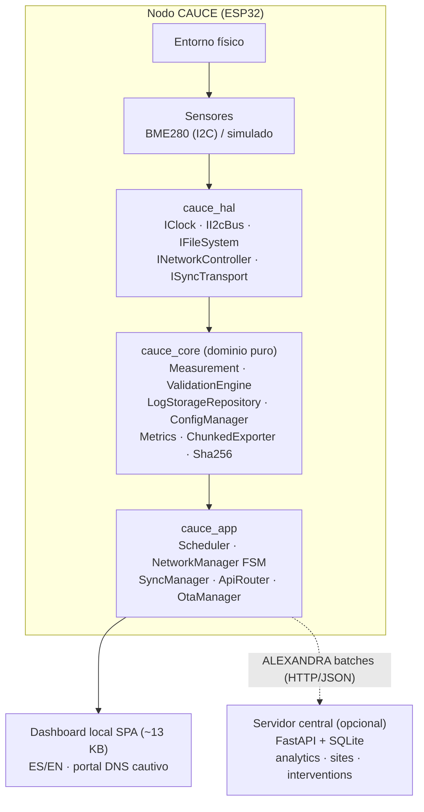
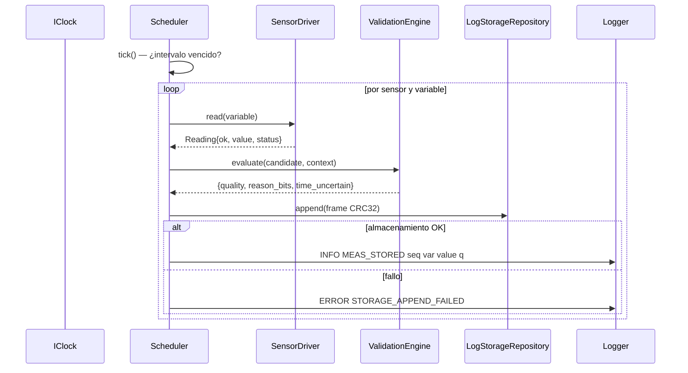
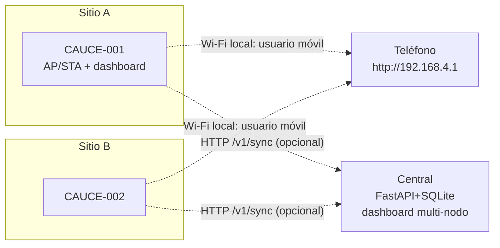
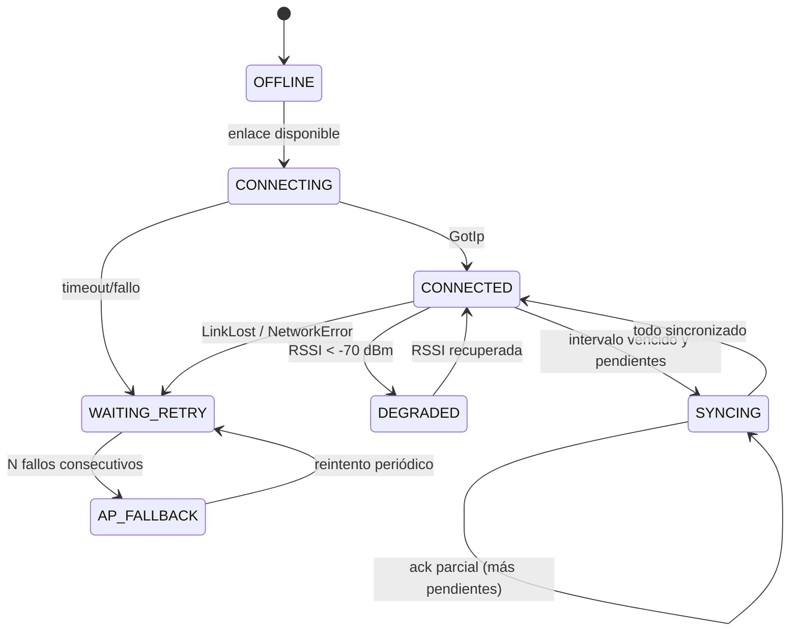

# CAUCE: Red Comunitaria de Microestaciones Climáticas

## Título completo

**CAUCE: diseño y estudio de una infraestructura distribuida de microcontroladores con operación offline-first para adquisición, procesamiento, almacenamiento y sincronización eventual de información en el borde — el monitoreo ambiental hiperlocal como caso de uso y ALEXANDRA como protocolo de intercambio**

---

## Resumen

Este trabajo estudia, sobre un sistema implementado y verificable, la siguiente pregunta tecnológica: ¿puede una red de microcontroladores de bajo costo operar como plataforma distribuida de adquisición, validación, almacenamiento e intercambio de información en el borde (*edge*), sin depender de conectividad permanente ni de un servidor central para sus funciones esenciales? El objeto de estudio es CAUCE (Red Comunitaria de Microestaciones Climáticas), una infraestructura de nodos basados en ESP32 que adquieren variables ambientales (temperatura del aire, humedad relativa, presión, iluminancia y tensión de batería), las validan estadísticamente en el propio dispositivo, las persisten en formato binario con integridad verificable (CRC-32 por registro, segmentos *append-only* con sellado ante corrupción), exponen una API HTTP local con interfaz web embebida, y sincronizan eventualmente hacia un servidor central mediante un protocolo idempotente clave `(node_id, sequence)` con marca de agua persistente. El contrato de intercambio se denomina **ALEXANDRA** (*Autonomous Local EXchange for Distributed Resource Architecture*); en su implementación actual comprende tres subsistemas verificables: (i) una interfaz REST de recursos en el nodo, (ii) un protocolo de lotes nodo–servidor con acuses honestos y reanudación sin duplicados, y (iii) un formato versionado de intercambio en reposo. La verificación se realiza mediante 97 pruebas unitarias/de integración en anfitrión, 22 pruebas del servidor, un flujo automatizado extremo a extremo (cliente C++ real contra servidor FastAPI vivo, verificado directamente en SQLite) y compilación cruzada al objetivo ESP32. El documento analiza críticamente el grado real de descentralización —híbrido: autonomía total del nodo con coordinación central opcional—, cuantifica el procesamiento ejecutado en el borde, documenta limitaciones materiales (sin cifrado en tránsito, radio Wi-Fi pendiente de validación física, sin descubrimiento entre pares) y propone líneas de evolución.

---

## Abstract

This work studies, on an implemented and verifiable system, the following technological question: can a network of low-cost microcontrollers operate as a distributed platform for acquisition, validation, storage and information exchange at the edge, without depending on permanent connectivity or a central server for its essential functions? The object of study is CAUCE, an infrastructure of ESP32-based nodes that acquire environmental variables (air temperature, relative humidity, pressure, illuminance, battery voltage), validate them statistically on-device, persist them in binary form with verifiable integrity (per-record CRC-32, append-only segments sealed on corruption), expose a local HTTP API with an embedded web UI, and eventually synchronize to a central server through an idempotent protocol keyed by `(node_id, sequence)` with a persistent watermark. The exchange contract is named **ALEXANDRA** (*Autonomous Local EXchange for Distributed Resource Architecture*); its current implementation comprises three verifiable subsystems: (i) a REST resource interface on the node, (ii) a node–server batch protocol with honest acknowledgements and duplicate-free resumption, and (iii) a versioned at-rest format. Verification relies on 97 host unit/integration tests, 22 server tests, an automated end-to-end pipeline (a real C++ client against a live FastAPI server, checked directly in SQLite) and cross-compilation to the ESP32 target. The document critically analyzes the actual degree of decentralization (hybrid: full node autonomy, optional central coordination), quantifies edge-side processing, documents material limitations (no transport encryption, Wi-Fi radio pending physical validation, no peer discovery), and proposes evolution paths.

**Palabras clave**: sistemas embebidos; microcontroladores; edge computing; IoT; sistemas distribuidos; operación offline-first; consistencia eventual; redes de sensores inalámbricas; ESP32; monitoreo ambiental.

**Keywords**: embedded systems; microcontrollers; edge computing; IoT; distributed systems; offline-first operation; eventual consistency; wireless sensor networks; ESP32; environmental monitoring.

---

# 1. Introducción

El modelo dominante de Internet de las Cosas concentra la inteligencia en servidores remotos: los dispositivos capturan señales, las transmiten, y la validación, el almacenamiento histórico y la visualización ocurren en la nube. Ese modelo implica dependencias estructurales —conectividad continua, disponibilidad remota, confianza en un operador externo— que resultan frágiles cuando la conectividad es intermitente o cuando la función local del dispositivo no la requiere.

Este trabajo aborda el problema desde el extremo opuesto: determinar qué funcionalidad puede trasladarse íntegramente a un microcontrolador de bajo costo sin sacrificar rigor de ingeniería. La pregunta se estudia sobre CAUCE, un sistema implementado cuyo caso de uso principal es el monitoreo ambiental hiperlocal: redes densas de microestaciones que caracterizan el microclima urbano a escala de manzana, donde el sombreado vegetal, la capacidad térmica de las superficies y la geometría urbana producen variaciones espaciales que las estaciones sinópticas oficiales no resuelven.

La relevancia es doble. **Tecnológica**: CAUCE ejecuta en un microcontrolador con 520 KB de SRAM y sin sistema operativo un pipeline completo de adquisición, validación estadística, persistencia con integridad verificable por registro, API web embebida, interfaz de usuario local y sincronización eventual idempotente —funciones que convencionalmente se delegan a capas superiores—. **Metodológica**: el sistema está cubierto por pruebas automatizadas ejecutables sin hardware (97 en anfitrión más 22 del servidor y un flujo extremo a extremo), lo que permite estudiar sus propiedades de forma reproducible y separar hechos verificados de aspiraciones de diseño.

El intercambio de información entre nodos e infraestructura opcional se denomina **ALEXANDRA** (*Autonomous Local EXchange for Distributed Resource Architecture*). ALEXANDRA no es un componente adicional sino la denominación formal del contrato de intercambio que CAUCE implementa; su generalización hacia otros dominios y topologías se analiza como interpretación arquitectónica y trabajo futuro, distinguiéndola explícitamente de la implementación actual.

# 2. Planteamiento del problema

## 2.1 Problema ambiental

Las ciudades experimentan calentamiento diferencial intraurbano impulsado por sombreado, capacidad térmica superficial y geometría. Evaluar intervenciones locales de adaptación —arbolado, techos verdes, superficies reflectantes— exige mediciones hiperlocalizadas, simultáneas y sostenidas antes y después de la intervención. Las estaciones meteorológicas oficiales, escasas y situadas según criterios sinópticos, no proveen esa granularidad espacial ni esa densidad temporal local.

## 2.2 Problema tecnológico

La instrumentación hiperlocal con decenas o centenas de puntos plantea requisitos que el modelo centralizado atiende deficientemente:

| Requisito | Deficiencia típica del modelo centralizado |
|---|---|
| Operación sin Internet | Sin conectividad no hay medición visible ni histórica |
| Integridad ante cortes de energía | Pérdida de datos en buffers volátiles |
| Autonomía del punto de medición | El nodo es un capturador pasivo sin validación ni servicio local |
| Escalado horizontal | Servidor central como cuello de botella y punto único de fallo |
| Soberanía de datos | Los datos residen en infraestructura de terceros |

Formalmente: **diseñar una unidad computacional autónoma de bajo costo que garantice adquisición validada, persistencia íntegra y servicio local bajo particiones de red arbitrarias, con sincronización eventual hacia infraestructura opcional que no introduzca duplicados ni pérdidas ante cualquier patrón de fallos de comunicación o energía**. La dificultad reside en la conjunción: cada propiedad aislada tiene soluciones conocidas; su intersección sobre un microcontrolador sin RTOS, con memoria limitada y sin almacenamiento convencional, constituye el problema de ingeniería estudiado.

# 3. Justificación

- **Científica**: la validación de calidad ejecutada en origen (rangos físicos, saltos imposibles, sensores congelados, duplicados, incertidumbre temporal) descarta artefactos de medición antes del análisis, mejorando la aptitud comparativa de los datos.
- **Tecnológica**: demuestra que un contrato de sincronización idempotente con marca de agua persistente —patrón propio de sistemas distribuidos de clase servidor— es realizable sobre un microcontrolador sin RTOS ni API POSIX de archivos, con verificación automatizada extremo a extremo.
- **Ambiental**: habilita redes densas donde el costo marginal por punto está dominado por el hardware (BOM estimada 13–32 USD por nodo) y no por infraestructura de ingesta.
- **Educativa y comunitaria**: la operación local con interfaz web sin aplicación externa, la documentación reproducible y el BOM multi-proveedor permiten que una persona técnicamente competente construya, repare y opere un nodo sin depender del desarrollador original.
- **Arquitectónica**: aporta un caso de estudio completo —con pruebas— de los patrones *offline-first*, *store-and-forward* idempotente y degradación graciosa aplicados a sistemas embebidos restringidos.

# 4. Objetivos

## 4.1 Objetivo general

Analizar, sobre la implementación real de CAUCE, en qué medida una arquitectura de microcontroladores distribuidos puede sostener las funciones esenciales de adquisición, validación, almacenamiento, servicio local e intercambio eventual de información en el borde, caracterizando sus garantías, costos y límites.

## 4.2 Objetivos específicos

1. Caracterizar el pipeline de adquisición y validación científica ejecutado en el microcontrolador (variables, umbrales, estados de calidad).
2. Analizar el modelo de persistencia local append-only con integridad verificable y su comportamiento ante corrupción parcial.
3. Evaluar la autonomía local: API HTTP embebida, interfaz web sin dependencias externas y operación sin conectividad.
4. Especificar y verificar el protocolo de sincronización eventual ALEXANDRA (idempotencia, marca de agua, acuses honestos, reanudación).
5. Cuantificar el grado y límites de descentralización mediante taxonomía centralizado/distribuido/descentralizado/híbrido.
6. Analizar resiliencia ante fallos de sensor, red, energía y datos corruptos, según las pruebas existentes.
7. Evaluar la seguridad implementada y sus limitaciones.
8. Estudiar la generalización de la abstracción de recursos hacia dominios no ambientales.

# 5. Preguntas de investigación

- **P1** ¿Qué proporción del ciclo de vida de un dato (adquisición, validación, persistencia, servicio, visualización) puede ejecutarse íntegramente en un microcontrolador clase ESP32 sin comprometer rigor?
- **P2** ¿Qué garantías de integridad puede ofrecer un formato binario propio append-only frente a cortes de energía, y a qué costo?
- **P3** ¿Es suficiente la pareja `(node_id, sequence)` como clave de idempotencia para lograr sincronización eventual exactamente-una vez en el receptor, bajo pérdida arbitraria de mensajes y reinicios del nodo?
- **P4** ¿Qué significa operativamente "descentralización" en esta arquitectura, y qué rol residual es irrenunciable para el servidor central?
- **P5** ¿Qué clases de fallos degradan el sistema a funcionalidad reducida en lugar de fallar completamente, y mediante qué mecanismos?
- **P6** ¿La abstracción de recursos (medición/estado/configuración) es suficientemente general para dominios no ambientales?

# 6. Hipótesis

**H1 (autonomía)**: Un nodo basado en ESP32 puede sostener indefinidamente adquisición validada, almacenamiento íntegro y servicio web local ante ausencia total de conectividad, sin crecimiento ilimitado de memoria ni corrupción persistente, siempre que aplique política de retención.

**H2 (sincronización exacta)**: El protocolo ALEXANDRA —lotes versionados con clave `(node_id, sequence)`, marca de agua persistida tras cada acuse, y deduplicación en el receptor— garantiza que, ante cualquier interleaving de pérdidas, reordenamientos y reenvíos posteriores a pérdida de estado, el conjunto de registros en el servidor converja al conjunto local sin duplicados ni omisiones.

Estas hipótesis se contrastan con las verificaciones descritas en §22–§23; H1 se verifica por diseño y pruebas unitarias más demostración en anfitrión, quedando su confirmación física supeditada al banco de hardware; H2 cuenta con prueba automatizada extremo a extremo y argumento de deduplicación por clave primaria en el receptor.

# 7. Marco teórico

## 7.1 Sistemas embebidos y microcontroladores

Un sistema embebido acopla cómputo a un proceso físico con restricciones de tiempo, energía y memoria. El ESP32 (Espressif) integra dos núcleos Xtensa LX6 a 240 MHz, 520 KB de SRAM, radio Wi-Fi 802.11 b/g/n y periféricos I2C/SPI/UART, ejecutando aquí firmware C++17 sobre Arduino framework sin RTOS explícito en el hot-path (el framework provee un loop cooperativo sobre FreeRTOS subyacente). La ausencia de MMU y la heap fragmentable imponen disciplina: buffers fijos, cero asignaciones en el camino de medición y estructuras de tamaño estático —principios visibles en `Measurement` (≤72 B), los frames de almacenamiento y los buffers del exportador.

## 7.2 IoT y edge computing

El paradigma IoT conecta objetos físicos a redes de datos; su arquitectura canónica de referencia distingue capas de percepción, red y aplicación. El *edge computing* desplaza cómputo hacia esa capa de percepción para reducir latencia, ancho de banda y dependencia externa; el *fog computing* lo sitúa en intermediarios entre borde y nube. CAUCE maximiza el espectro edge: validación, persistencia, servicio web y decisión de calidad ocurren íntegramente en el microcontrolador; no existe capa fog —el servidor central es un extremo opcional de sincronización—.

## 7.3 Sistemas distribuidos, descentralización y consistencia eventual

Un sistema distribuido es aquel cuyo estado reside en múltiples nodos que se comunican por paso de mensajes, sujeto a latencias finitas y fallos parciales. El teorema CAP formaliza el compromiso entre consistencia, disponibilidad y tolerancia a particiones bajo sincronización débil. La familia BASE (*Basically Available, Soft state, Eventually consistent*) renuncia a la consistencia fuerte inmediata a cambio de disponibilidad, con convergencia posterior. En ese marco, CAUCE adopta: **disponibilidad local siempre** (cada nodo es autoridad de su propio log append-only, sin conflicto posible al no existir escritura remota), y **consistencia eventual hacia el centro** mediante transferencia monotónica idempotente (§13). No hay escritura multi-master ni necesidad de resolución CRDT: la propiedad de que cada registro tiene un único productor elimina la clase de conflictos que esos mecanismos resuelven.

## 7.4 Redes de sensores y adquisición

Las redes de sensores inalámbricas (WSN) estudian nodos con sensado, cómputo y comunicación integrados. Aportes clásicos incluyen el compromiso energía–latencia–fiabilidad y la agregación en red. CAUCE difiere de la WSN clásica en tres puntos: comunicación Wi-Fi IP (alta tasa, mayor consumo) en lugar de radios de baja potencia; agregación **en nodo** (no en red); y existencia de servicio directo al usuario desde el propio sensor (dashboard embebido).

## 7.5 Sistemas ciberfísicos e instrumentación ambiental

Un sistema ciberfísico cierra el ciclo entre fenómeno físico y cómputo. En instrumentación ambiental importan: trazabilidad de metadatos de instalación (sitio, altura, exposición), control de calidad en tiempo real, y separación entre dato crudo, dato validado y métrica derivada. CAUCE materializa esta separación en tipos (`Measurement` con `quality` y `reason_bits`) y reglas analíticas documentadas.

## 7.6 Offline-first y store-and-forward

El diseño offline-first trata la desconexión como caso normal, no excepcional. Patrones asociados: estado local autoritativo, cola de salida durable, reenvío idempotente, reconciliación por marca de agua. CAUCE implementa todos: el log local es la fuente de verdad; la sincronización es proyección derivada con watermark `(last_acked_seq)` persistida tras cada acuse.

# 8. Estado del arte

| Familia | Representantes | Conectividad | Operación sin servidor | Validación en borde | UI local | Almacenamiento íntegro local |
|---|---|---|---|---|---|---|
| Plataformas comunitarias ambientales | SmartCitizen Kit; Sensor.Community | Wi-Fi a Internet, push continuo | No (ingesta central requerida) | Parcial (servidor/cliente ligero) | Remota | Limitada |
| Redes LoRaWAN + TTN | nodos clase The Things Node | LoRa → gateway → red central | No | No | No | Mínima |
| Gateways edge industriales | pasarelas industriales comerciales | Variada | Parcial (según producto) | Sí | Propia del producto | Sí (BD embebida) |
| Nodos educativos ESP32 | plantillas Arduino/MicroPython | Wi-Fi push HTTP/MQTT | No | No | Rara | Buffer volátil |
| **CAUCE/ALEXANDRA** | este trabajo | Wi-Fi local (AP/STA); sync opcional a central | **Sí** (API+UI+histórico locales) | **Sí** (pipeline estadístico) | **Sí** (SPA embebida ES/EN) | **Sí** (frames CRC32, sellado) |

Trabajos académicos relacionados: las WSN clásicas establecen sensado distribuido con restricción energética; la literatura fog/edge argumenta el traslado de cómputo hacia el dato; los sistemas de datos modernos codifican patrones de idempotencia y marcas de agua que ALEXANDRA adapta al ámbito embebido. La comparación honesta indica que la contribución de CAUCE no reside en ningún elemento aislado —todos existen individualmente— sino en la **combinación verificada de autonomía total del nodo con integridad demostrable y sincronización exacta**, sobre hardware de menos de USD 35, con cobertura automatizada completa.

# 9. Arquitectura de CAUCE

## 9.1 Visión por capas



La dependencia es estrictamente descendente: el dominio (`cauce_core`) no incluye cabeceras de hardware ni de framework; toda interacción física pasa por interfaces de `cauce_hal`, lo que permite ejecutar la totalidad del dominio en anfitrión con dobles de prueba.

## 9.2 Pipeline de medición



Cada etapa puede fallar sin detener el ciclo: lectura fallida incrementa contadores y, tras dos fallos consecutivos, emite un registro `MISSING`; fallo de almacenamiento se registra y reintenta en el siguiente tick. La secuencia arranca del máximo almacenado +1 al reiniciar, eliminando duplicados post-corte.

## 9.3 Topología desplegada



# 10. El nodo CAUCE como unidad computacional

| Función | Componente real | Evidencia |
|---|---|---|
| Adquisición | `Bme280Driver` (modo forzado, compensación entera Bosch + espejo float de contraste); `SimulatedSensorDriver` con inyección de fallas | Tests contra vector del datasheet; tests de fallas |
| Procesamiento | `ValidationEngine`: no-finito, rango físico, tasa de cambio, valor congelado (≥6 lecturas idénticas en ε=0.01), secuencia duplicada; `Metrics` (media, mediana, desviación muestral, percentiles interpolados, agregación por ventanas, exposición trapezoidal) | 9 + 8 pruebas |
| Almacenamiento | `LogStorageRepository`: frames de 72 B `[0xCA][0x01][len=60][payload][CRC32]`, rotación por tamaño, retención con tope, sellado de segmento corrupto | 6 pruebas incl. recuperación tras reinicio |
| Comunicación | `ApiRouter` (8 recursos REST + streaming paginado ≥384 B/chunk), `Esp32ApiServer` sobre WebServer con *chunked transfer*, `SyncManager` (lotes ≤32 registros, buffer 4096 B, backoff 10 s→1800 s, auth-backoff 900 s, halt ante rechazo) | 12 pruebas de router; 8 de sync; E2E |
| Autonomía | Dashboard SPA embebido (~13 KB, ES/EN), portal DNS wildcard, operación íntegra sin Internet | Pruebas de integridad HTML; DNS compilación-verificado |

El nodo es, por tanto, simultáneamente productor, custodio y proveedor de su información: ninguna función esencial requiere un par externo.

# 11. Edge computing en CAUCE

Del ciclo de vida del dato, las seis primeras etapas ocurren íntegramente en el microcontrolador:

| Etapa | Ubicación | Detalle |
|---|---|---|
| Adquisición | Nodo | Conversión I2C + compensación científica |
| Validación | Nodo | Pipeline estadístico con estados y bits de razón |
| Filtrado | Nodo | Exclusión de INVALID/MISSING/ESTIMATED de toda métrica |
| Persistencia | Nodo | Append-only CRC32, retención acotada |
| Visualización | Nodo | SPA servida localmente, gráfico canvas nativo |
| Servicio API | Nodo | REST versionada con autenticación admin |
| Sincronización | Nodo→Central | Única función cooperativa (puede omitirse) |

**Ventajas**: latencia local nula para consulta, privacidad por residencia de datos, degradación graciosa, costo marginal de red cero. **Limitaciones**: cómputo acotado (sin modelos pesados), capacidad histórica finita (presupuesto configurable, defecto 512 KiB ≈ 7 000 registros), análisis transversal multi-nodo imposible sin el central.

# 12. Arquitectura distribuida y descentralizada

Siguiendo la taxonomía estándar:

| Modelo | Definición operativa | ¿Aplica a CAUCE? |
|---|---|---|
| Centralizado | Un punto posee estado y servicio; los demás son periféricos dependientes | No: cada nodo funciona sin el centro |
| Distribuido | Estado repartido entre nodos que cooperan hacia un objetivo común | Parcialmente: hay múltiples nodos con estado propio, pero sin cooperación directa entre pares |
| Descentralizado puro | Pares equivalentes coordinan sin autoridad alguna | No implementado: no existe intercambio nodo↔nodo |
| Híbrido (federado) | Autonomía plena en los bordes + servicios centrales opcionales | **Sí: descripción más precisa** |

Conclusión terminológica: CAUCE es un sistema **híbrido con autonomía total del borde**. La descentralización existe en el plano del *control de datos* (cada nodo es autoridad y custodio), mientras la coordinación analítica permanece centralizable opcionalmente. Denominar "descentralizado puro" al sistema actual sería impreciso.

# 13. Protocolo ALEXANDRA

**ALEXANDRA — Autonomous Local EXchange for Distributed Resource Architecture** — es el protocolo de intercambio distribuido asociado a la arquitectura CAUCE. En su formulación actual, ALEXANDRA define cómo un recurso (una medición, un estado, una configuración) producido en un nodo se representa, se custodia localmente y se transfiere hacia infraestructura opcional garantizando idempotencia y trazabilidad. Este capítulo distingue explícitamente tres planos: **[I] implementación actual**, **[A] interpretación arquitectónica**, **[F] evolución propuesta**.

## 13.1 Principios [I]

| # | Principio | Materialización |
|---|---|---|
| A-1 | Identidad inmutable del registro | Clave `(node_id, sequence)`; `sequence` monotónica persistida tras reinicio |
| A-2 | Integridad verificable en reposo | Frame binario con CRC-32 por registro; sellado de segmento ante cola corrupta |
| A-3 | Acuse honesto | `acknowledged_sequence` = mayor secuencia realmente persistida en el receptor; jamás fabricado |
| A-4 | Idempotencia | Deduplicación por clave primaria en el servidor; reenvíos sin efecto económico-datos |
| A-5 | Reanudación | Marca de agua persistida tras cada acuse; ante pérdida del archivo de estado se reinicia desde 0 y el reenvío completo converge por A-4 |
| A-6 | Versionado | `protocol_version=1` en sobre y frame; rechazo explícito de versiones no soportadas |
| A-7 | Degradación segura | Backoff exponencial ante errores de red; backoff fijo largo ante fallo de autenticación; **halt** definitivo ante rechazo semántico |

## 13.2 Mensajes [I]

**Sobre de lote nodo→central** (`POST /v1/sync`):

```json
{"protocol_version":1,"node_id":"CAUCE-001","batch_size":    5,
 "measurements":[{"node_id":"CAUCE-001","sensor_id":"BME280-1",
   "sequence":1842,"timestamp":"2026-08-22T00:01:00Z",
   "timestamp_utc_ms":1787356860000,"variable":"air_temperature",
   "value":21.50,"unit":"C","quality":"VALID","reason_bits":0,
   "time_uncertain":false}]}
```

**Acuse central→nodo**: `200 {"acknowledged_sequence":1842}` · `401/403` credenciales · `422/409` rechazo semántico (el cliente detiene la sincronización) · errores de red → reintento con backoff.

**Recursos REST del nodo** (interfaz de intercambio directo): `/api/v1/node`, `/status`, `/measurements/latest`, `/measurements?from&to`, `/health`, `/config` (GET público; POST con Bearer→SHA-256), `/export?format=csv|json`. Formatos de intercambio: CSV RFC 4180 y JSON array, ambos servidos en flujo paginado.

## 13.3 Máquina de estados del intercambio [I]



Backoffs: red 5 s→300 s exponencial; sync 10 s→1800 s; autenticación 900 s fijos. La marca de agua se escribe en flash tras cada acue individual.

## 13.4 Planos no implementados

- **[A] Recursos genéricos**: el par variable–unidad y los estados de calidad son independientes del dominio climático; ALEXANDRA puede leerse como esquema general de intercambio de recursos telemétricos firmados por productor+secuencia (§14).
- **[F] Intercambio entre pares**: descubrimiento mDNS/ESP-NOW, réplica nodo↔nodo y fusión CRDT no existen en el código; quedan como evolución.
- **[F] Confianza criptográfica**: firmas de lotes y manifiestos firmados para OTA son propuesta; hoy la integridad en reposo es CRC (detección) y la autenticación es token simétrico.

# 14. Modelo de recursos

La interfaz REST del nodo expone ya recursos direccionables: `node` (identidad/versiones), `status` (estado FSM + última medición), `measurements` (colección consultable y exportable), `health` (telemetría interna), `config` (estado mutable protegido). Esta forma sugiere una generalización donde cada capacidad del nodo —sensor, batería, almacenamiento, incluso actuadores futuros— se publique como recurso con identidad, versión e intercambio ALEXANDRA. Los componentes estrictamente ambientales se reducen al catálogo de variables y umbrales físicos (`Thresholds`); el resto (pipeline de validación, frames, API, sync, OTA) es genérico. Así, dominios como agricultura (humedad de suelo como nueva `Variable`), energía (corriente/tensión), o monitoreo urbano (ruido, ocupación) requieren añadir tipos al catálogo y calibración específica, sin modificar el núcleo del protocolo ni el almacenamiento.

# 15. Comunicación

Tecnologías realmente presentes: **Wi-Fi 802.11 b/g/n** vía ESP32 en modos AP (portal/dashboard) y STA (cliente HTTP); **HTTP/1.1** con transferencia fragmentada para API y dashboard, y POST JSON para sincronización; **DNS** wildcard para portal cautivo; **I2C** a 100 kHz para el sensor. No existen en el código: MQTT, CoAP, ESP-NOW, Bluetooth ni malla (*mesh*).

Comparación justificada: HTTP se eligió por interoperabilidad universal (navegadores, curl, servidores), depurabilidad y ausencia de dependencias; su costo es mayor sobrecarga por mensaje que MQTT/CoAP, aceptable dada la cadencia de sincronización (minutos). Para redes sin IP o de bajo consumo extremo, LoRaWAN o ESP-NOW serían candidatos de evolución [F], requiriendo adaptar el transport de ALEXANDRA (interfaz `ISyncTransport` ya aísla ese punto).

# 16. Funcionamiento offline

| Escenario | Comportamiento real | Verificación |
|---|---|---|
| Sin Internet desde el arranque | Medición, validación, almacenamiento, dashboard y API operan normalmente; registros marcados `time_uncertain` si no hay fuente temporal | Pruebas con reloj invalidado |
| Pérdida durante operación | FSM → `WAITING_RETRY` con backoff; sync suspendido; medición continúa | Tests de FSM |
| Reinicio del nodo | Apertura reconstruye contadores/última secuencia escaneando segmentos; cola corrupta sella el segmento y rota | Test `corrupted_tail_is_isolated_on_reopen` |
| Corte de energía a mitad de escritura | El CRC detecta el frame parcial; los previos permanecen válidos | Diseño + prueba de basura al final de segmento |
| Servidor caído | Backoff exponencial hasta 1800 s; datos íntegros locales; sin pérdida | Tests de sync con transporte en fallo |

El sistema mantiene así sus funciones esenciales indefinidamente sin par externo, cumpliendo H1 en el plano lógico.

# 17. Almacenamiento y datos

## 17.1 Modelo

Cada medición ocupa un **frame** de 72 bytes: cabecera de 4 (`magic 0xCA`, `version 0x01`, longitud u16), carga útil de 60 (secuencia u32, marca temporal u64, valor f32, variable, calidad, bits de razón, incertidumbre temporal, `node_id[16]`, `sensor_id[24]`) y CRC-32 IEEE (polinomio reflejado 0xEDB88320) sobre los 64 bytes previos. Formato *little-endian* explícito e independiente del compilador.

## 17.2 Integridad y recuperación

La lectura secuencial valida el CRC de cada frame; ante el primer fallo se asume cola parcial (escritura interrumpida) y el segmento se **sella**: sus registros válidos permanecen consultables y las escrituras nuevas rotan a un segmento limpio —sin necesidad de truncado en flash—. El historial previo queda preservado, con probabilidad de detección 1−2⁻³² por frame alterado.

## 17.3 Presupuesto y escalado

Con valores por omisión (512 KiB totales, segmentos de 64 KiB ≈ 910 frames) y cadencia de 60 s, el nodo retiene ≈15 h a resolución completa antes de rotar; la retención elimina el segmento más antiguo conservando siempre uno. Ventanas mayores corresponden al central: SQLite con índices `(node_id, timestamp)` y `(variable, timestamp)`.

## 17.4 Tiempo

Marcas en ms UTC; sin fuente confiable se almacenan en 0 con bandera `time_uncertain`, conservando orden local por secuencia. La reconstrucción temporal posterior a NTP es trabajo futuro [F].

# 18. Resiliencia

| Fallo | Mecanismo | Resultado | Verificación |
|---|---|---|---|
| Sensor desconectado | Lectura falla → contador → placeholder `MISSING` tras 2 ciclos; demás sensores continúan | Degradación por sensor | test scheduler |
| Sensor congelado | Racha idéntica ≥6 en ε=0.01 → `SUSPECT` | Datos marcados | test validation |
| Pérdida de conectividad | FSM red → backoff; medición intacta | Autonomía total | suites network/sync |
| Reinicio | Escaneo reconstruye estado; secuencia continúa desde máx+1 | Sin duplicados | test storage/scheduler |
| Fallo de almacenamiento | Contador + log; reintento siguiente ciclo | Nodo operativo | test scheduler |
| Corrupción de datos | CRC + sellado + rotación | Historial válido preservado | test storage |
| Servidor caído | Backoff exponencial; watermark persiste | Reenvío exacto al volver | E2E fase 3 |
| OTA con imagen corrupta | Hash streaming ≠ manifiesto → abort; partición alternativa intacta | `VERIFY_FAILED` | suite ota |

# 19. Seguridad

**Implementado**: tokens administrativos guardados solo como SHA-256 (vectores NIST verificados) y comparados en tiempo constante tanto en nodo como en servidor; validación estricta de toda entrada externa (rangos, longitudes acotadas); buffers estáticos sin asignaciones en hot-path; separación lectura pública / escritura autenticada; fail-closed (POST /config sin token configurado → 503); rate limiting por IP con memoria acotada en el central; ocultamiento de secretos en GET `/config`; privacidad mínima (solo telemetría ambiental e identificadores de nodo).

**Limitaciones honestas**: sin cifrado en tránsito (HTTP plano en LAN); identidad del nodo auto-declarada (sin criptografía de dispositivo); sin firma de lotes ni de imágenes OTA —el hash del manifiesto protege integridad de descarga, no autenticidad de origen—; portal DNS cautivo acepta cualquier dominio por diseño. Coherente para piloto comunitario en red local; insuficiente para exposición pública amplia.

# 20. Caso de uso ambiental

Variables implementadas: temperatura del aire (−40..85 °C; ±5/min), humedad relativa (0–100 %RH; ±20/min), presión (300–1100 hPa; ±2/min), iluminancia (0–200 000 lx), tensión de batería (2.5–4.5 V). La arquitectura habilita:

- **Microclima y variación espacial**: nodos co-instalados comparables tras calibración relativa por co-localización (procedimiento documentado).
- **Estrés térmico**: exposición trapezoidal sobre umbral (p. ej., horas >32 °C) calculada en nodo y replicable en central.
- **Evaluación antes/después**: intervenciones con ventana temporal; el endpoint separa estadísticos pre/post y **declara insuficiencia muestral** (<30 válidas por período) antes que permitir conclusiones débiles.
- **Calidad como ciudadano de primera clase**: calidad y motivo por dato; métricas excluyen INVALID/MISSING/ESTIMATED.

Limitaciones específicas: sin certificado metrológico (exactitud = datasheet del fabricante, no verificada por el proyecto); deriva y autocalentamiento sin caracterizar; la exposición física, determinante, se documenta pero no se instrumenta.

# 21. Generalización de la arquitectura

| Categoría | Componentes |
|---|---|
| Genéricos dominio-neutral | Frames+CRC, repositorio append-only, validador paramétrico, exportadores, API REST, sync idempotente, OTA, config, logger, estadística |
| Parametrizables | Catálogo variables/unidades, umbrales físicos, metadatos de sitio |
| Específicos ambientales | BME280 y compensación, umbrales climáticos por defecto |
| Específicos de hardware | HAL ESP32 (I2C/Wi-Fi/LittleFS/reloj) |

Dominios candidatos con cambio mínimo: agricultura (humedad de suelo, conductividad), energía (corriente/tensión por circuito), infraestructura (vibración, ocupación), educación (plataforma docente de sistemas distribuidos reales). Condición arquitectónica: expresar el nuevo dominio como recursos monótonos de productor único —la propiedad que elimina conflictos de réplica—.

# 22. Análisis técnico

| Dimensión | Valor/comportamiento | Fuente |
|---|---|---|
| Flash firmware | ≈363 KB de 1.3 MB (27.7 %) | build esp32dev |
| RAM | Buffers fijos; sin heap en hot-path | diseño |
| Registro | 72 B → ≈7 100 registros en 512 KiB | formato |
| Cadencia | 60 s por defecto; configurable 10–3600 s | NodeConfig |
| Latencia consulta local | HTTP en LAN servido desde flash/RAM locales | arquitectura |
| Sincronización | Lotes ≤32 registros declarados; drenaje continuo mientras existan pendientes; backoff hasta 1800 s | SyncManager |
| Energía | Sin deep sleep implementado; Wi-Fi activo continuo → consumo alto; política solo advisory | STATUS.md |
| Escalabilidad central | Ingesta O(1) amortizada por registro (PK dedup); analítica O(n) por consulta; adecuado a 10¹–10² nodos | backend |
| Mantenibilidad | 119 pruebas automatizadas; CI 5 trabajos; docs reproducibles | repositorio |
| Costo | BOM 13–32 USD/nodo multi-proveedor | HARDWARE.md |

Fórmulas implementadas — tasa de cambio: r = Δv / Δt_min; desviación muestral: s = √( Σ(xᵢ−x̄)² / (n−1) ); percentil interpolado lineal entre órdenes; exposición: E = Σ (tᵢ₊₁ − tᵢ) para intervalos consecutivos ambos sobre umbral, en horas; backoff exponencial acotado: tₙ = min(t₀·2^(n−1), t_max).

# 23. Discusión

Frente a la literatura de WSN, CAUCE invierte dos supuestos clásicos: prioriza Wi-Fi IP sobre radios de baja potencia (aceptando mayor consumo a cambio de servicio directo al usuario y reutilización de infraestructura doméstica), y agrega en nodo en lugar de en red. Frente al paradigma nube-céntrico de IoT, demuestra que el borde puede asumir validación, custodia íntegra y presentación sin pérdida de rigor, posicionándose en el extremo edge-dominante del espectro fog/edge [20].

El protocolo ALEXANDRA corresponde funcionalmente a patrones consolidados —cursor/watermark de ingesta, llave de idempotencia, store-and-forward— aplicados bajo restricciones embebidas [9], [15]. La contribución no es teórica sino de integración verificada: la propiedad combinada «sin duplicados ante cualquier interleaving» está demostrada por prueba automatizada extremo a extremo, incluido el escenario adversario de pérdida total del estado del cliente.

# 24. Limitaciones

1. **Hardware no validado físicamente**: lo verificado corre en anfitrión o por compilación cruzada; BME280 real, LittleFS, radio Wi-Fi y cortes de energía reales permanecen pendientes de banco.
2. **Seguridad**: sin TLS ni firmas criptográficas; identidad auto-declarada; portal DNS abierto.
3. **Energía**: sin deep sleep; operación continua incompatible con alimentación solar modesta sin dimensionamiento específico.
4. **Escaneo de apertura O(archivo)**: aceptable hasta ≈10⁵ registros.
5. **Analítica central O(n)** sin agregados persistentes para horizontes largos.
6. **Transporte único** HTTP/JSON; sin formato binario compacto ni compresión para enlaces estrechos.
7. **Descentralización incompleta**: sin descubrimiento ni réplica entre pares; el central concentra la vista agregada (no la integridad).
8. **Precisión científica**: dependiente de calibración relativa aún no ejecutada; sin trazabilidad metrológica.
9. **Mantenimiento de campo**: sustitución de sensores exige recalibración documentada manual.
10. **Complejidad multi-perfil**: HAL+dominio+app+backend exige perfil full-stack; mitigada por la suite automatizada.

# 25. Trabajo futuro

1. **ALEXANDRA [F]**: intercambio entre pares vía ESP-NOW/mDNS con fusión por secuencia; manifiestos y lotes firmados; transporte CBOR/CoAP opcional [12].
2. **Banco físico**: validación BME280/LittleFS/Wi-Fi; ensayos instrumentados de corte de energía; aplicación de `SleepPolicy` con deep sleep.
3. **OTA completa**: lector HTTP nativo ESP32, firma de imágenes, confirmación post-arranque por contador.
4. **Seguridad progresiva**: TLS o tokens por dispositivo derivados en provisioning; autorización granular en el central.
5. **Tiempo**: NTP y reconstrucción temporal de registros `time_uncertain` tras primera sincronización.
6. **Analítica persistente**: agregados precomputados y comparación multi-nodo normalizada por calibración relativa.
7. **Nuevas topologías**: pasarelas LoRa para sitios sin Wi-Fi; réplicas regionales del central.
8. **Actuadores**: extensión del modelo de recursos a comandos idempotentes con confirmación.

# 26. Conclusiones

- **Qué es CAUCE**: una infraestructura distribuida e híbrida de microestaciones basadas en ESP32 cuyo caso de uso principal es el monitoreo ambiental hiperlocal, construida como plataforma generalizable de adquisición–custodia–intercambio en el borde.
- **Qué arquitectura implementa**: capas estrictas con dominio puro independiente de hardware; persistencia append-only con integridad verificable por registro; API y UI locales embebidas; sincronización eventual opcional; actualización segura por partición alternativa.
- **Cuánto procesamiento ocurre en el edge**: la totalidad del ciclo salvo la analítica transversal multi-nodo —adquisición, validación estadística auditable, filtrado, almacenamiento íntegro, visualización local, exportación y autenticación—.
- **Qué grado de descentralización posee**: autonomía plena de datos y función en cada nodo (offline-first estricto), con coordinación central opcional y no irrenunciable; formalmente híbrido, no par-a-par.
- **Qué papel cumple ALEXANDRA**: es el contrato formal de intercambio —recursos REST versionados en el nodo, lotes idempotentes `(node_id, sequence)` con acuse honesto y marca de agua persistente, formato versionado en reposo—; su núcleo está implementado y verificado; sus extensiones entre pares y criptográficas son evolución propuesta.
- **Qué demuestra (H1, H2)**: que la conjunción de §2.2 es alcanzable sobre un microcontrolador de bajo costo con cobertura automatizada —97 pruebas de firmware, 22 del servidor y E2E contra servidor real— incluido el caso adversario de pérdida completa del estado del cliente sin duplicados ni omisiones.
- **Limitaciones**: validación física pendiente, ausencia de cifrado/firma, energía continua requerida hoy, escaneo y analítica acotados al tamaño del piloto.
- **Potencial de generalización**: alto —el núcleo es dominio-neutral—, condicionado a que los nuevos dominios conserven la propiedad de productor único por recurso que fundamenta la simplicidad de ALEXANDRA.

---

# Referencias

[1] I. Akyildiz, W. Su, Y. Sankarasubramaniam, E. Cayirci, «Wireless sensor networks: a survey», *Computer Networks*, vol. 38, nº 4, pp. 393–422, 2002.

[2] F. Bonomi, R. Milito, J. Zhu, S. Addepalli, «Fog Computing and Its Role in the Internet of Things», *Proc. First Edition of the MCC Workshop on Mobile Cloud Computing*, ACM, 2012.

[3] E. Brewer, «Towards Robust Distributed Systems», keynote, *ACM Symposium on Principles of Distributed Computing (PODC)*, 2000.

[4] Espressif Systems, *ESP32 Series Datasheet*, v4.x, y *ESP32 Technical Reference Manual*, documentación oficial, 2023. Disponible en: https://www.espressif.com/en/support/documents/technical-documents

[5] Bosch Sensortec, *BME280: Combined humidity and pressure sensor*, datasheet BST-BME280-DS002, 2022. Disponible en: https://www.bosch-sensortec.com

[6] R. Fielding, J. Reschke (eds.), «Hypertext Transfer Protocol (HTTP/1.1): Semantics and Content», RFC 7231, IETF, 2014.

[7] S. Gilbert, N. Lynch, «Brewer's conjecture and the feasibility of consistent, available, partition-tolerant web services», *ACM SIGACT News*, vol. 33, nº 2, pp. 51–59, 2002.

[8] ISO/IEC 30141:2018, *Information technology — Internet of Things (IoT) — Reference architecture*, ISO/IEC, 2018.

[9] M. Kleppmann, *Designing Data-Intensive Applications*, O'Reilly Media, 2017.

[10] L. Lamport, «Time, Clocks, and the Ordering of Events in a Distributed System», *Communications of the ACM*, vol. 21, nº 7, pp. 558–565, 1978.

[11] OASIS, *MQTT Version 5.0*, OASIS Standard, 2019. Disponible en: https://docs.oasis-open.org/mqtt/mqtt/v5.0/

[12] Z. Shelby, K. Hartke, C. Bormann, «The Constrained Application Protocol (CoAP)», RFC 7252, IETF, 2014.

[13] J. H. Saltzer, M. D. Schroeder, «The Protection of Information in Computer Systems», *Proceedings of the IEEE*, vol. 63, nº 9, pp. 1278–1308, 1975.

[14] W. Shi, J. Cao, Q. Zhang, Y. Li, L. Xu, «Edge Computing: Vision and Challenges», *IEEE Internet of Things Journal*, vol. 3, nº 5, pp. 637–646, 2016.

[15] A. S. Tanenbaum, M. van Steen, *Distributed Systems: Principles and Paradigms*, 3ª ed., distributed-systems.net, 2017.

[16] W. Vogels, «Eventually Consistent», *Communications of the ACM*, vol. 52, nº 1, pp. 40–44, 2009.

[17] A. Demers et al., «Epidemic Algorithms for Replicated Database Maintenance», *Proc. ACM PODC*, pp. 1–12, 1987.

[18] F. Adelantado et al., «Understanding the Limits of LoRaWAN», *IEEE Communications Magazine*, vol. 55, nº 9, 2017.

[19] Y. Shafranovich, «Common Format and MIME Type for Comma-Separated Values (CSV) Files», RFC 4180, IETF, 2005.

[20] Espressif Systems, *ESP-IDF Programming Guide — Over The Air (OTA) Updates*, documentación oficial, consulta 2026. https://docs.espressif.com/projects/esp-idf/en/latest/esp32/api-reference/system/ota.html

[21] Institute for Advanced Architecture of Catalonia, *SmartCitizen Kit — Documentation*, consulta 2026. https://docs.smartcitizen.me

[22] Sensor.Community, *Documentation of the participative sensor network*, consulta 2026. https://sensor.community

[23] The Things Network, *LoRaWAN architecture documentation*, consulta 2026. https://www.thethingsnetwork.org/docs

[24] CAUCE Project, *Repositorio de implementación de referencia* (firmware, backend, simulador y suite de verificación automatizada), fuente primaria de este trabajo, versión analizada 2026.

---

# Anexos

## Anexo A. Layout binario del frame de medición (72 bytes)

| Offset | Tamaño | Campo | Codificación |
|---|---|---|---|
| 0 | 1 | magic | 0xCA |
| 1 | 1 | version | 0x01 |
| 2 | 2 | payload_len | u16 LE (=60) |
| 4 | 4 | sequence | u32 LE |
| 8 | 8 | timestamp_utc_ms | u64 LE (0 = tiempo incierto) |
| 16 | 4 | value | IEEE-754 f32 LE |
| 20 | 1 | variable | enum u8 |
| 21 | 1 | quality | enum u8 |
| 22 | 1 | reason_bits | bitmask u8 |
| 23 | 1 | time_uncertain | 0/1 |
| 24 | 16 | node_id | char[] NUL-terminado |
| 40 | 24 | sensor_id | char[] NUL-terminado |
| 64 | 4 | crc32 | CRC-32 (poly 0xEDB88320 reflejado) sobre bytes [0..63] |

## Anexo B. Ejemplo de lote ALEXANDRA (nodo → central)

```json
{"protocol_version":1,"node_id":"CAUCE-001","batch_size":    5,
 "measurements":[{"node_id":"CAUCE-001","sensor_id":"BME280-1",
   "sequence":1842,"timestamp":"2026-08-22T00:01:00Z",
   "timestamp_utc_ms":1787356860000,
   "variable":"air_temperature","value":21.50,"unit":"C",
   "quality":"VALID","reason_bits":0,"time_uncertain":false}]}
```

Acuse: `200 {"acknowledged_sequence":1842}`. El relleno del campo `batch_size` usa espacios (JSON válido); su ancho fijo permite parcheo in-place sin segundo búfer.

## Anexo C. Umbrales de validación por omisión

| Variable | Rango | Variación máx./min |
|---|---|---|
| air_temperature | −40..85 °C | ±5 |
| relative_humidity | 0..100 %RH | ±20 |
| pressure | 300..1100 hPa | ±2 |
| illuminance | 0..200000 lx | ±120000 |
| battery_voltage | 2.5..4.5 V | ±0.2 |

Congelamiento: racha ≥6 lecturas idénticas dentro de ε = 0.01. Sesgo temporal máximo tolerado hacia el futuro: 120 s.

## Anexo D. Inventario de verificación automatizada

| Suite (firmware/test) | Pruebas |
|---|---|
| validation · codec · storage · config · security · bme280 | 9·5·6·9·4·5 |
| scheduler_integration · export · metrics · network · sync · api(cpp) · ota | 5·6·8·8·8·14·10 |
| **Total firmware (anfitrión)** | **97** |
| Backend (pytest): ingesta idempotente, auth, rate-limit, filtros, analytics×5, dashboard i18n, CSV global | **22** |
| Integración E2E | 4 fases + aserciones SQLite |

## Anexo E. Configuración de nodo (extracto)

```
node_id=CAUCE-001
sampling_interval_s=60
sync_interval_s=900
storage_max_bytes=524288
segment_max_bytes=65536
wifi_enabled=0
admin_token_sha256=<hex sha-256>
thr_range_min_air_temperature=-40.00
```
